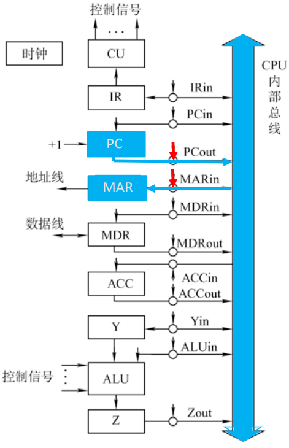
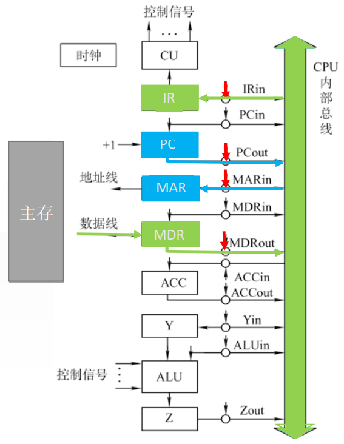

# 总线

内部总线是指同一部件(如CPU内部)连接各寄存器及运算部件之间的总线

系统总线是指同一台计算机系统的各部件，如CPU、内存、通道和各类I/O接口间互相连接的总线。

# 寄存器之间数据传送

比如把PC内容送至MAR，实现传送操作的流程及控制信号为：

1. `(PC) → Bus` PCout有效，PC内容送到总线
2. `Bus → MAR` MARin有效，总线内容送到MAR

也可写为： `(PC)→Bus→MAR` 或 `PC→Bus→MAR`

# 主存与CPU之间的数据传送

比如CPU从主存读取指令，实现传送操作的流程及控制信号为：

1. `(PC)→Bus→MAR` PCout和MARin有效
2. `1→R` CU发读命令(通过控制总线发出)
3. `MEM(MAR)→MDR` 数据从主存读到MDR
4. `MDR→Bus→IR` MDRout和IRin有效

# 执行算术或逻辑运算

比如一条加法指令，微操作序列及控制信号为：

1. `Ad(IR)→Bus→MAR` MDRout和MARin有效(或AdIRout和MARin有效)
2. `1→R` CU发读命令
3. `MEM(MAR)→数据线→MDR` MDRin有效
4. `MDR→Bus→Y` MDRout和Yin有效，操作数送到Y
5. `(ACC)+(Y)→Z` ACCout和ALUin有效，CU向ALU发送加命令
6. `Z→ACC` Zout和ACCin有效，结果放到ACC
