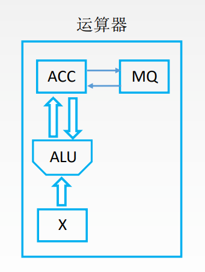

# 运算器的基本组成

运算器：用于实现算术运算（如：加减乘除）、逻辑运算（如：与或非）

- ACC： 累加器，用于存放操作数，或运算结果。
- MQ： 乘商寄存器，在乘、除运算时，用于存放操作数或运算结果。
- X： 通用的操作数寄存器，用于存放操作数
- ALU： 算术逻辑单元，通过内部复杂的电路实现算数运算、逻辑运算

# 控制器的基本组成

- CU：控制单元，分析指令，给出控制信号
- IR：指令寄存器，存放当前执行的指令
- PC：程序计数器，存放下一条指令地址，有自动加1功能

