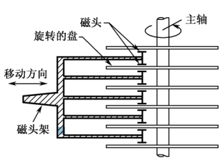
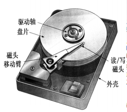
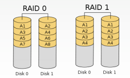
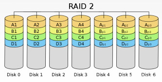

# 磁盘存储器

磁表面存储: 是指把某些磁性材料薄薄地涂在金属铝或塑料表面上作为载磁体来存储信息。磁盘存储器、磁带存储器和磁鼓存储器均属于磁表面存储器。

磁表面存储器的优点：
1. 存储容量大，位价格低；
1. 记录介质可以重复使用；
1. 记录信息可以长期保存而不丢失，甚至可以脱机存档；
1. 非破坏性读出，读出时不需要再生。

磁表面存储器的缺点：
1. 存取速度慢；
1. 机械结构复杂；
1. 对工作环境要求较高。

硬盘属于机械式部件，其读写操作是串行的，不可能在同一时刻既读又写，也不可能在同一时刻读两组数据或写两组数据。

## 磁盘设备的组成



一块硬盘含有若干个记录面，每个记录面划分为若干条磁道，而每条磁道又划分为若干个扇区，扇区(也称块)是磁盘读写的最小单位，也就是说磁盘按块存取。

磁头数(Heads): 即记录面数，表示硬盘总共有多少个磁头，磁头用于读取/写入盘片上记录面的信息，一个记录面对应一个磁头。

柱面数(Cylinders): 表示硬盘每一面盘片上有多少条磁道。在一个盘组中，不同记录面的相同编号(位置)的诸磁道构成一个圆柱面。

扇区数(Sectors): 表示每一条磁道上有多少个扇区。

磁盘驱动器：核心部件是磁头组件和盘片组件，温彻斯特盘是一种可移动头固定盘片的硬盘存储器。

磁盘控制器：是硬盘存储器和主机的接口，主流的标准有IDE、SCSI、SATA等。



## 磁盘的性能指标

磁盘的容量: 一个磁盘所能存储的字节总数称为磁盘容量。磁盘容量有非格式化容量和格式化容量之分。非格式化容量是指磁记录表面可以利用的磁化单元总数。格式化容量是指按照某种特定的记录格式所能存储信息的总量。

记录密度: 记录密度是指盘片单位面积上记录的二进制的信息量，通常以道密度、位密度和面密度表示。道密度是沿磁盘半径方向单位长度上的磁道数;位密度是磁道单位长度上能记录的二进制代码位数;面密度是位密度和道密度的乘积。磁盘所有磁道记录的信息量一定是相等的，并不是圆越大信息越多，故每个磁道的位密度都不同。

平均存取时间：平均存取时间 = 寻道时间(磁头移动到目的磁道)+ 旋转延迟时间(磁头定位到所在扇区)+ 传输时间(传输数据所花费的时间)

数据传输率：磁盘存储器在单位时间内向主机传送数据的字节数，称为数据传输率。假设磁盘转数为r(转/秒)，每条磁道容量为N个字节，则数据传输率Dr=rN

## 磁盘地址

```
[驱动器号] [柱面(磁道)号] [盘面号] [扇区号]
```

若系统中有4个驱动器，每个驱动器带一个磁盘，每个磁盘256个磁道、16个盘面，每个盘面划分为16个扇区，则每个扇区地址要18位二进制代码
```
[驱动器号(2bit)] [柱面(磁道)号(8bit)] [盘面号(4bit)] [扇区号(4bit)]
```

## 磁盘阵列

RAID（ Redundant Array of Inexpensive Disks，廉价冗余磁盘阵列）是将多个独立的物理磁盘组成一个独立的逻辑盘，数据在多个物理盘上分割交叉存储、并行访问，具有更好的存储性能、可靠性和安全性。

RAID的分级:
1. RAID0：无冗余和无校验的磁盘阵列。RAID0把连续多个数据块交替地存放在不同物理磁盘的扇区中，几个磁盘交叉并行读写，不仅扩大了存储容量，而且提高了磁盘数据存取速度，但RAID0没有容错能力。
1. RAID1：镜像磁盘阵列。RAID1是为了提高可靠性，使两个磁盘同时进行读写，互为备份，如果一个磁盘出现故障，可从另一磁盘中读出数据。两个磁盘当一个磁盘使用，意味着容量减少一半。
1. RAID2：采用纠错的海明码的磁盘阵列。逻辑上连续的几个bit物理上分散存储在各个盘中4bit信息位+3bit海明校验位,可纠正一位错误
1. RAID3：位交叉奇偶校验的磁盘阵列。
1. RAID4：块交叉奇偶校验的磁盘阵列。
1. RAID5：无独立校验的奇偶校验磁盘阵列。





# 光盘存储器

光盘存储器是利用光学原理读/写信息的存储装置，它采用聚焦激光束对盘式介质以非接触的方式记录信息。

光盘的类型：
1. CD-ROM：只读型光盘，只能读出其中内容，不能写入或修改。
1. CD-R：只可写入一次信息，之后不可修改。
1. CD-RW：可读可写光盘，可以重复读写。
1. DVD-ROM：高容量的CD-ROM，DVD表示通用数字化多功能光盘。

# 固态硬盘

固态硬盘除了需要Flash Memory外，还需要其他硬件和软件的支持。闪存(Flash Memory)是在E2PROM的基础上发展起来的，本质上是只读存储器。
