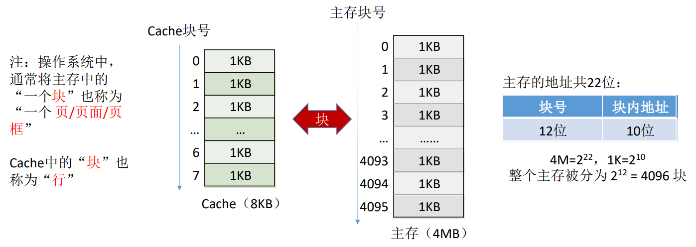
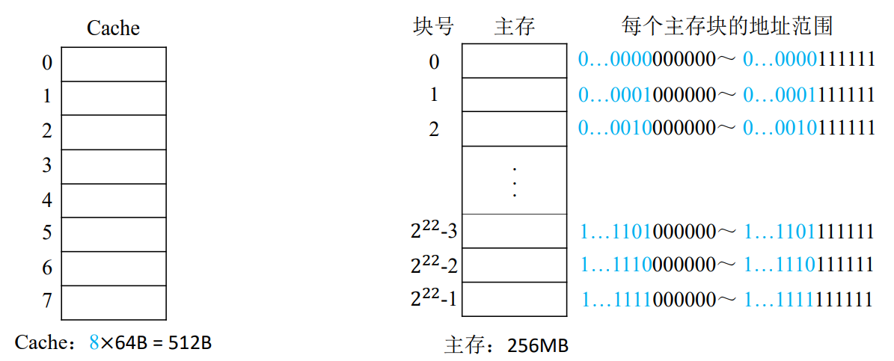
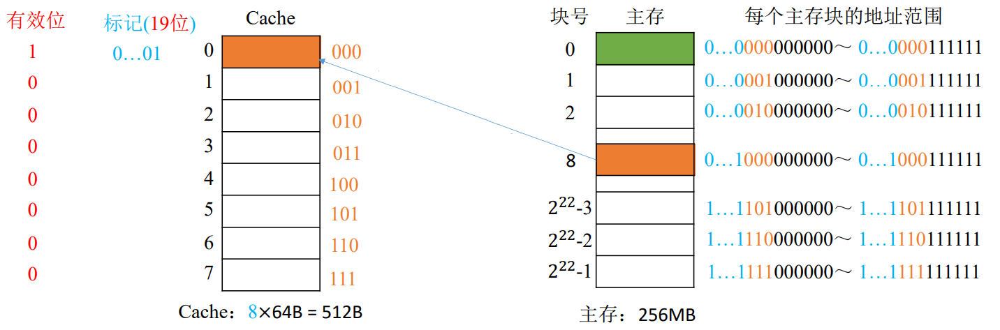
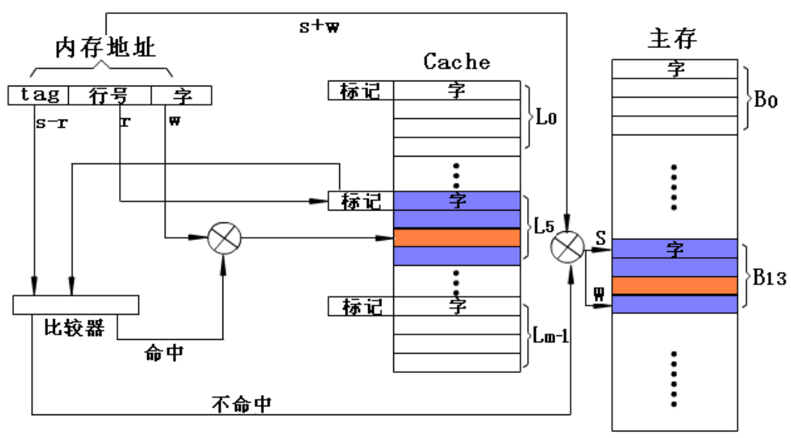
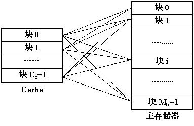
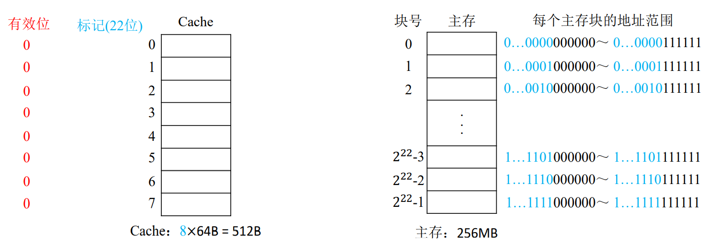
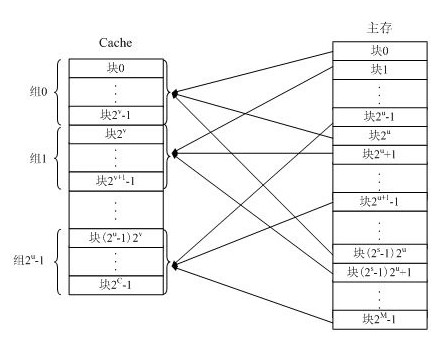
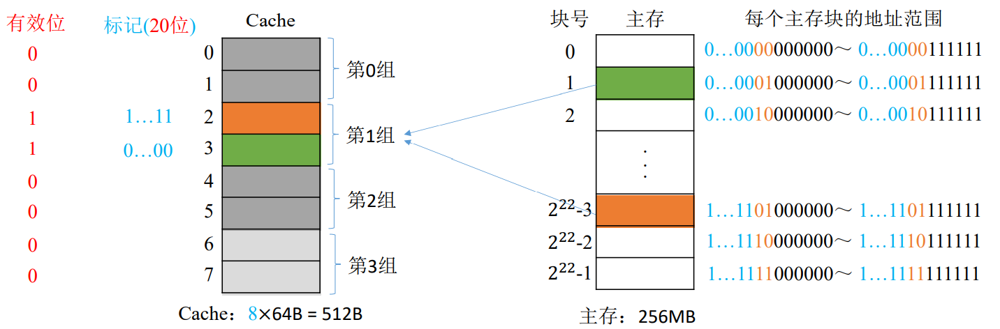
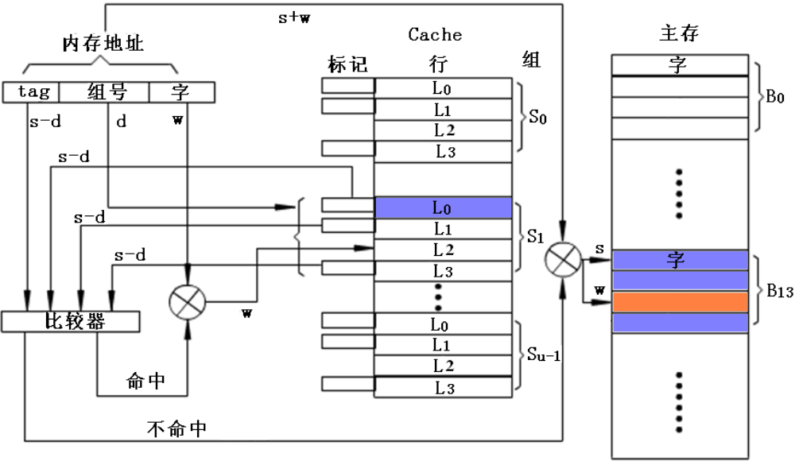

# 分块

将若干个存储字组成一个块, 主存和Cache的块大小保持一致。

对于一个n位地址的存储空间, 如果分成了2^m个块, 则需要m位地址表示所有的块, 称为m位块地址。剩下的n-m位则表示每个块内有n-m个字, 称为n-m位块内地址。

对于主存和cache, 它们的块地址不同, 块内地址相同。



# 直接映射

- 主存的第1个块映射到cache的第1个块
- 主存的第2个块映射到cache的第2个块
- ......
- 主存的第i个块映射到cache的最后一个块
- 主存的第i+1个块再次映射到cache的第1个块
- 主存的第i+2个块再次映射到cache的第2个块
- ......

`主存块在Cache中的位置 = 主存块号 % Cache总块数`


## 例子

设主存地址空间大小为256MB, 按字节编址, 其数据Cache有8个块, 块大小为64B

256M=228 主存的地址共28位, 块内地址6位, 块号22位

Cache的块内地址6位, 块号3位



`主存块号 % Cache总块数`等价于块号的最后三位二进制数, 如:

- 第2块在Cache中的位置为`2 % 8 = 2`, 二进制表示为`010`
- 第4194303块(2^22-1)在Cache中的位置为`4194303 % 8 = 7`, 二进制表示为`111`

所以若Cache总块数为2^n, 则主存块号末尾n位直接反映它在Cache中的位置, 这n位就不需要存储到标记位中

标记部分的长度为: `主存的块号位数-cache的块号位数`

所以, cpu要访问的地址(即主存地址)被划分为:

```
标记位(19位) Cache块号(3位) 块内地址(6位)
```



# 直接映射的cache检索过程

在直接映射方式中, 首先用r位行号(块地址)找到cache中的对应块, 取出该块的标记部分, 然后用地址中的s-r位标记部分与块的标记在比较器中做比较。
若符合命中, 就在cache中找到了对应的块, 然后用地址中最低位w(块内地址)读取所需的字。
若未命中, 按内存地址从主存中读取这个字。



## 例子

设 CPU 访问主存地址`0…01000 001110`

1. 根据主存块号的后3位确定Cache行, 取出这行的标记位
2. 若主存块号的前19位与Cache标记位匹配, 且有效位=1则Cache命中
3. 访问块内地址为`001110`的单元
4. 若未命中或有效位=0, 则访问主存

## 优缺点

- 优点：硬件简单, 容易实现
- 缺点：命中率低,  Cache的存储空间利用率低

# 全相联映射

主存的一个块直接映射到cache中的任意一行上。



由于主存的任何一个块都可能映射到cache中的任何一个块, 所以cache的标记位需要存储主存行号的所有位。

## 例子

设主存地址空间大小为256MB, 按字节编址, 其数据Cache有8个块, 块大小为64B

256M=228 主存的地址共28位, 块内地址6位, 块号22位

Cache的块内地址6位, 块号3位



# 全相联映射方式检索过程

在全相联映射方式中, 将内存地址的s位块号与cache中所有行的标记同时在比较器中做比较。
若块号命中, 按w位字地址从cache中读取一个字。
若未命中, 则按内存地址从主存中读取这个字。


## 例子

设 CPU 访问主存地址`1…1101001110`

1. 用主存地址的前22位对比Cache中所有块的标记
2. 若标记匹配且有效位=1, 则Cache命中, 访问块内地址为`001110`的单元
3. 若未命中或有效位=0, 则访问主存

## 优缺点

- 优点：命中率较高, Cache的存储空间利用率高
- 缺点：线路复杂, 成本高, 速度低

# 组相联映射

将cache分成若干组, 每组若干行, 主存的块先按顺序找到cache的某个组, 再映射到该组内的块, 即组间采用直接映射, 组内为全相联映射

`所属分组 = 主存块号 % 分组数`



## 例子

设主存地址空间大小为256MB, 按字节编址, 其数据Cache有8个块, 块大小为64B

256M=228 主存的地址共28位, 块内地址6位, 块号22位

Cache的块内地址6位, 块号3位, 为2路组相联映射, 即2个块为一组, 分4组

与直接映射类似, 标记部分的长度为: `主存的块号位数-cache的组号位数`

所以, cpu要访问的地址(即主存地址)被划分为:

```
标记位(20位) Cache组号(2位) 块内地址(6位)
```



# 组相联cache的检索过程

在组相联映射方式中, 首先用给定s位块号的低d位找到cache的相应组, 然后将块号的高s-d位与该组中每块的所有标记同时比较, 哪一块的标记相符即该行命中。再以内存地址的低w位检索此行对应的字。



## 例子

设 CPU 访问主存地址`1…1101001110`

1. 根据主存块号的后2位确定所属分组号
2. 若主存块号的前20位与分组内的某个标记匹配且有效位=1, 则Cache命中, 访问块内地址为`001110`的单元。
3. 若未命中或有效位=0, 则访问主存

## 优缺点

- 优点：硬件较简单, 速度较快, 命中率较高
