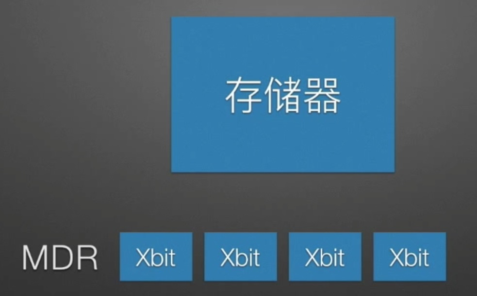
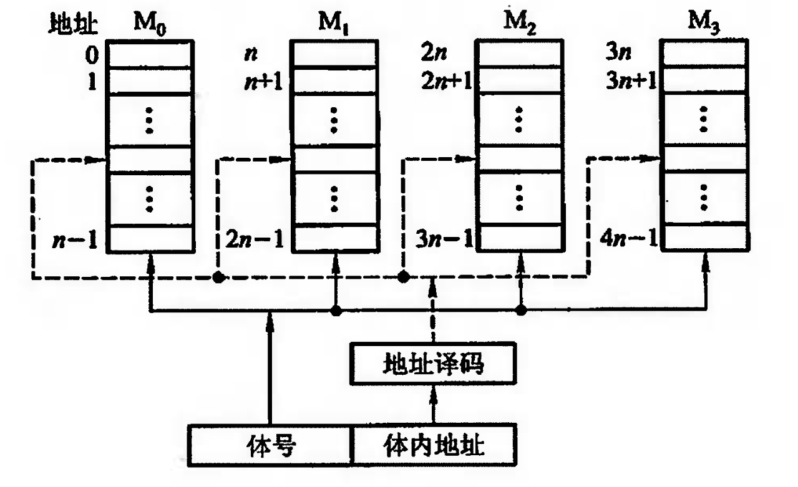
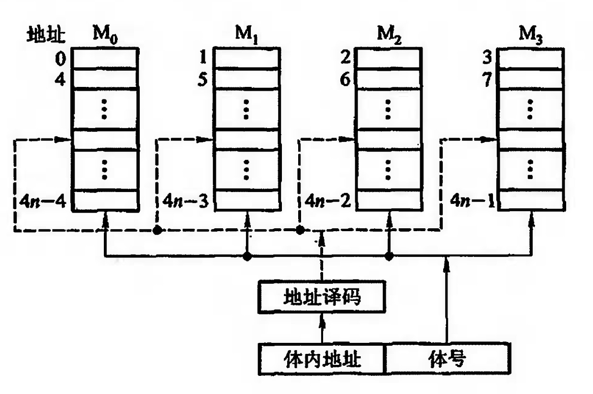
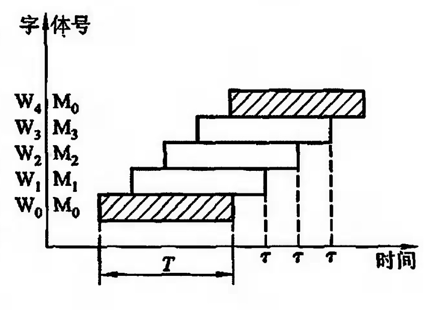

# 单体多字并行存储器

在同一个存取周期内可以访问多个字

一旦遇到转移指令, 或者操作数不连续存放, 这种方法的效果就不明显。

# 多体并行存储器

## 高位交叉编址的多体存储器

体号在高位, 体内地址在低位

每个字的访问顺序为:
1. 第1个体的第1个字
2. 第1个体的第2个字
3. 第1个体的第3个字
4. ...

## 低位交叉编址的多体存储器

体内地址在高位, 体号在低位

每个字的访问顺序为:
1. 第1个体的第1个字
2. 第2个体的第1个字
3. 第3个体的第1个字
4. ...

# 多体并行存储器的访问速度

设: 总线传输周期为τ, 存取周期为T, 一个存储周期能访问一个存储字。求连续存取n个存储字的时间

## 高位交叉编址的多体存储器

由于在访问完某一个存储体的存储单元前, 其他存储单元是不可访问的。所以高位交叉编址的多体存储器如果要访问4个存储字就需要4个存取周期T。

### 采用高位交叉编址, 连续取n个存储字, 耗时nT

## 低位交叉编址的多体存储器

由于连续的几个低位地址在不同的存储体, 所以不需要等待这个存储体访问能完成就可以访问下一个存储体。

假设有4个存储体:

假设启动完M0后启动M1的时间间隔是τ, 启动完M1在启动M2的时间间隔是τ、启动完M2在启动M3的时间间隔是τ, 接下来启动完M3在启动M0的时间间隔也是τ, 所以访问完4个字的总时间为T+3τ

### 假如连续存取n个存储字, 采用低位交叉编址, 耗时：T+(n-1)τ
