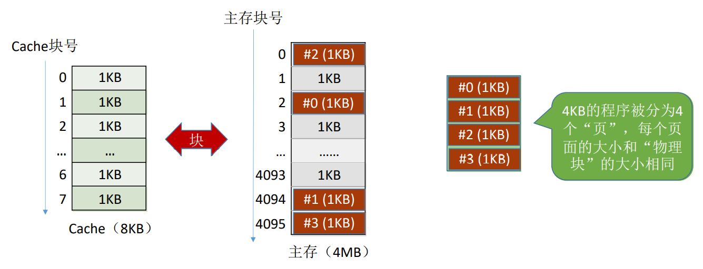
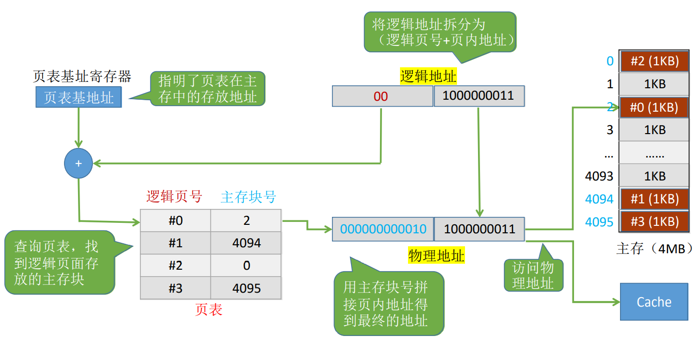
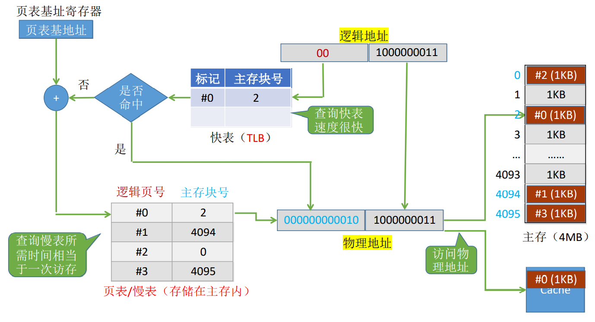

# 页式存储

页式存储系统：一个程序(进程)在逻辑上被分为若干个大小相等的“页面”，“页面”大小与主存的“块”的大小相同。每个页面可以离散地放入不同的主存块中。

# 虚地址与实地址

逻辑地址（虚地址）：程序员视角看到的地址。如：整个程序共 4KB，则虚地址范围：`000000000000~111111111111`

物理地址（实地址）：实际在主存中的地址

# 页表

CPU执行的机器指令中，使用的是“逻辑地址”，因此需要通“页表”将逻辑地址转为物理地址。

页表记录了每个页存放在哪个主存块中。

# 地址变换过程

# 快表

由于页表数据在主存里，访问速度比较慢。为了加快地址变换的速度，将近期访问的页表项拷贝到一个由SRAM实现的相联存储器中，这个存储器称为快表。

# 相联存储器

相联存储器是一种不根据地址而是根据存储内容来进行存取的存储器。

写入信息时按顺序写入，不需要地址。

读出时，要求CPU给出一个相联关键字，用它和存储器中所有单元中的一部分信息进行比较，若它们相等，则将此单元中余下的信息读出。

# 含有快表的地址变换过程

