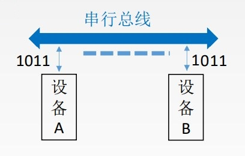

# 串行总线

优点：只需要一条传输线，成本低廉，广泛应用于长距离传输；应用于计算机内部时，可以节省布线空间。

缺点：在数据发送和接收的时候要进行拆卸和装配，要考虑串行并行转换的问题。

# 并行总线

优点：总线的逻辑时序比较简单，电路实现起来比较容易。

缺点：信号线数量多，占用更多的布线空间；远距离传输成本高昂；由于工作频率较高时，并行的信号线之间会产生严重干扰，对每条线等长的要求也越高，所以无法持续提升工作频率。

# 速度对比

工作频率相同时，串行总线传输速度比并行总线慢。

并行总线的工作频率无法持续提高，而串行总线可以通过不断提高工作频率来提高传输速度，最终超过并行总线。
