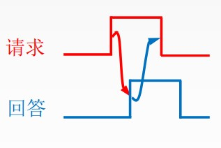
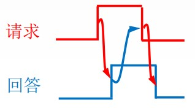
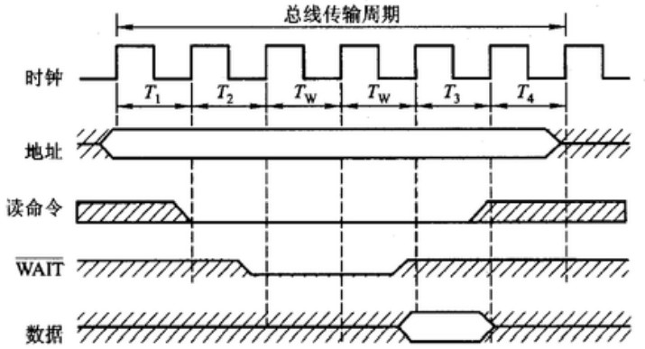

# 总线传输的四个阶段

1. 申请分配阶段：由需要使用总线的主模块（或主设备）提出申请，经总线仲裁机构决定将下一传输周期的总线使用权授予某一申请者。也可将此阶段细分为传输请求和总线仲裁两个阶段。
2. 寻址阶段：获得使用权的主模块通过总线发出本次要访问的从模块的地址及有关命令，启动参与本次传输的从模块。
3. 传输阶段：主模块和从模块进行数据交换，可单向或双向进行数据传送。
4. 结束阶段：主模块的有关信息均从系统总线上撤除，让出总线使用权。

# 总线定时

总线定时是指总线在双方交换数据的过程中需要时间上配合关系的控制，这种控制称为总线定时，它的实质是一种协议或规则总线周期的四个阶段

# 同步定时方式(同步通信)

同步定时方式是指系统采用一个统一的时钟信号来协调发送和接收双方的传送定时关系。

假设：CPU作为主设备，某个输入设备作为从设备

1. CPU在T1时刻的上升沿给出地址信息
2. 在T2的上升沿给出读命令（低电平有效），与地址信息相符合的输入设备按命令进行一系列的内部操作，且必须在T3的上升沿来之前将CPU所需的数据送到数据总线上。
3. CPU在T3时钟周期内，将数据线上的信息传送到其内部寄存器中。
4. CPU在T4的上升沿撤销读命令，输入设备不再向数据总线上传送数据，撤销它对数据总线的驱动。

优点：传送速度快，具有较高的传输速率；总线控制逻辑简单。

缺点：主从设备属于强制性同步；不能及时进行数据通信的有效性检验，可靠性较差。\

同步通信适用于总线长度较短及总线所接部件的存取时间比较接近的系统。

# 异步定时方式(异步通信)

在异步定时方式中，没有统一的时钟，也没有固定的时间间隔，完全依靠传送双方相互制约的“握手”信号来实现定时控制

主设备提出交换信息的“请求”信号，经接口传送到从设备；从设备接到主设备的请求后，通过接口向主设备发出“回答”信号。

根据“请求”和“回答”信号的撤销是否互锁，分为以下3种类型。

1. 不互锁方式
2. 半互锁方式
3. 全互锁方式

## 不互锁方式

主设备发出“请求(地址信息、读命令之类)”信号后，不必等到接到从设备的“回答(要读出的数据之类)”信号，而是经过一段时间，便撤销“请求”信号。

而从设备在接到“请求”信号后，发出“回答”信号，并经过一段时间，自动撤销“回答”信号。双方不存在互锁关系。

## 半互锁方式

主设备发出“请求”信号后，必须待接到从设备的“回答”信号后，才撤销“请求”信号，有互锁的关系。

而从设备在接到“请求”信号后，发出“回答”信号，但不必等待获知主设备的“请求”信号已经撤销，而是隔一段时间后自动撤销“回答”信号，不存在互锁关系。

## 全互锁方式

主设备发出“请求”信号后，必须待从设备“回答”后，才撤销“请求”信号。

从设备发出“回答”信号，必须待获知主设备“请求”信号已撤销后，再撤销其“回答”信号。双方存在互锁关系。

优点：总线周期长度可变，能保证两个工作速度相差很大的部件或设备之间可靠地进行信息交换，自动适应时间的配合。

缺点：比同步控制方式稍复杂一些，速度比同步定时方式慢。

# 半同步通信

统一时钟的基础上，增加一个“等待”响应信号WAIT

# 分离式通信

其基本思想是即将一个传输周期(或总线周期)分解为两个子周期。

在第一个子周期中，主模块A在获得总线使用权后将命令、地址以及其他有关信息，包括主模块编号(当有多个主模块时，此编号尤为重要)发到系统总线上，经过总线传输后，由有关的从模块B接收下来。主模块A向系统总线发布这些信息只占用总线很短的时间，一旦发送完成，立即放弃总线使用权，以便其他模块使用。

在第二个子周期中，当B模块接收到A模块发来的有关命令信号后，经过选择、译码、读取等一系列内部操作，将A模块所需的数据准备好，然后B模块申请总线使用权，一旦获准，B模块便将A模块的编号、B模块的地址、A模块所需的数据等一系列信息送到总线上，供A模块接收。

这种通信方式的特点如下：

1. 个模块占用总线使用权都必须提出申请。
2. 在得到总线使用权后，主模块在限定的时间内向对方发送信息，采用同步方式传送，不再等待对方的回答信号。
3. 各模块在准备数据的过程中都不占用总线，是总线可以接受其他模块的请求。
4. 总线被占用时都在做有效工作，或者通过他发送命令，或者通过他传送数据，不存在空闲等待时间，充分地利用了总线的有效占用，从而实现了在多个主、从模块间进行交叉重叠并行式传送，这对大型计算机是极为重要的。

这种方式控制比较复杂，一般在普通微型计算机系统很少采用。
