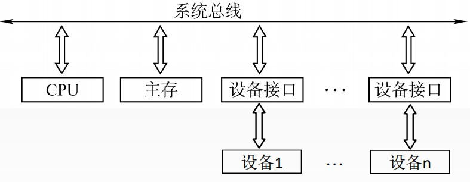
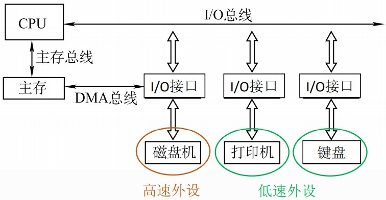

# 单总线结构

结构：CPU、主存、I/O设备（通过I/O接口）都连接在一组总线上，允许I/O设备之间、I/O设备和CPU之间或I/O设备与主存之间直接交换信息。

优点：结构简单，成本低，易于接入新的设备。

缺点：带宽低、负载重，多个部件只能争用唯一的总线，且不支持并发传送操作。

# 双总线结构

支持突发传送：送出一个地址，收到多个地址连续的数据。

通道是具有特殊功能的处理器，能对I/O设备进行统一管理。通道程序放在主存中。

结构：双总线结构有两条总线，一条是主存总线，用于CPU、主存和通道之间进行数据传送；另一条是I/O总线，用于多个外部设备与通道之间进行数据传送。

优点：将较低速的I/O设备从单总线上分离出来，实现存储器总线和I/O总线分离。

缺点：需要增加通道等硬件设备。

# 三总线结构

DMA：Direct Memory Access，直接内存访问。

结构：三总线结构是在计算机系统各部件之间采用3条各自独立的总线来构成信息通路，这3条总线分别为主存总线、I/O总线和直接内存访问DMA总线。

优点：提高了I/O设备的性能，使其更快地响应命令，提高系统吞吐量。

缺点：系统工作效率较低。

# 四总线结构(现代)

桥接器：用于连接不同的总线，具有数据缓冲、转换和控制功能。

## 北桥芯片

北桥（英语：Northbridge）用来处理高速信号，通常处理中央处理器、存储器、PCI Express显卡（早年是AGP显卡）、高速PCI Express X16/X8的端口，还有与南桥之间的通信。

## 南桥芯片

南桥（英语：Southbridge）用来处理低速信号，通过北桥与中央处理器联系。在部分的芯片组架构中，会将南桥的功能与北桥集成在一起；或者将部分功能移到北桥，而部分的南桥功能则删除，将被删除的接口功能使用额外独立的芯片组提供功能。这样使得整个芯片组架构中只会有单一芯片，而不会另外的有南桥芯片。
