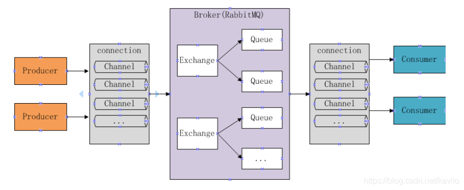

# RabbitMQ的工作原理

- Broker：消息队列服务进程，此进程包括两个部分：Exchange和Queue。
- Exchange：消息队列交换机，按一定的规则将消息路由转发到某个队列，对消息进行过滤。
- Queue：消息队列，存储消息的队列，消息到达队列并转发给指定的消费者。
- Producer：消息生产者，即生产方客户端，生产方客户端将消息发送到MQ。
- Consumer：消息消费者，即消费方客户端，接收MQ转发的消息。

# 生产者发送消息流程

- 生产者和Broker建立TCP连接。
- 生产者和Broker建立通道。
- 生产者通过通道把消息发送给Broker，由Exchange将消息进行转发。
- Exchange将消息转发到指定的Queue。

# 消费者接收消息流程

- 消费者和Broker建立TCP连接。
- 消费者和Broker建立通道。
- 消费者监听指定的Queue。
- 当有消息到达Queue时Broker默认将消息推送给消费者。
- 消费者接收到消息。
- 消费者回复ack。

# 消息确认机制（ACK）

当消费者获取消息后，会向RabbitMQ发送回执ACK，告知消息已经被接收。

ACK分两种情况：

- 自动ACK：消息一旦被接收，消费者自动发送ACK
- 手动ACK：消息接收后，不会发送ACK，需要手动调用

如果消息不太重要，丢失也没有影响，那么自动ACK会比较方便

如果消息非常重要，不容丢失。那么最好在消费完成后手动ACK，否则接收消息后就自动ACK，RabbitMQ就会把消息从队列中删除。如果此时消费者宕机，那么消息就丢失了。

自动ACK存在的问题: 消费者抛出异常，依然会发送ACK
