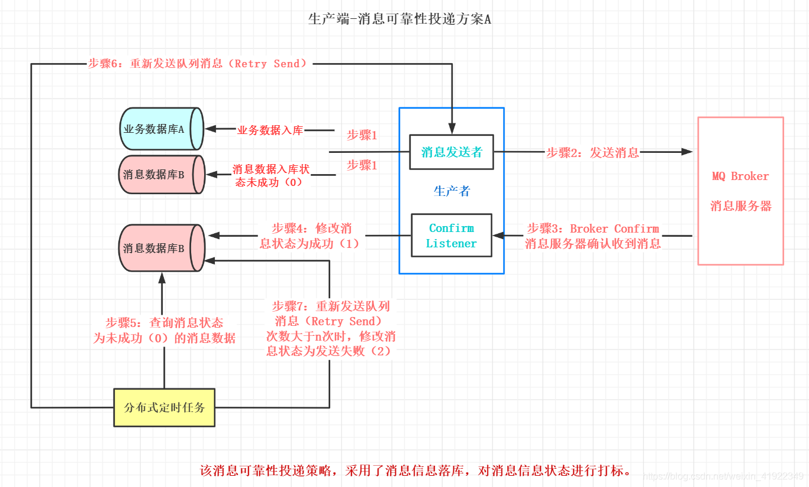
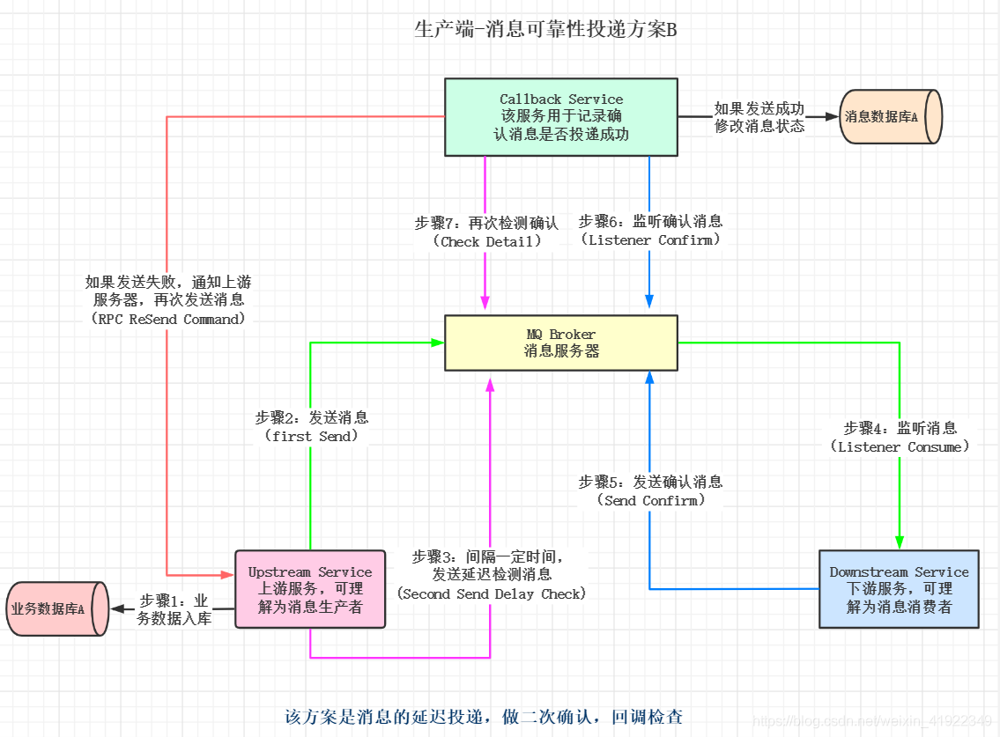

# 消息落库方案

1. 业务数据和消息数据入库（此时消息状态为未成功0）。
2. 向消息服务器发送消息。
3. 消息服务器收到消息后，发送确认消息（确认应答) Ack。
4. 生产者接收到服务器发送的确认消息 Ack，修改数据库中消息的状态为成功（1）。
5. 定时任务，查询数据库中消息状态为未成功（0）的数据。
6. 重新发送未成功的消息。
7. 定时任务查询，当重新发送的次数，大于一定的值时，修改该条消息状态为发送失败（2）。

# 延迟投递方案

1. 上游服务器（消息生产者）维护业务数据入库。
2. 上游服务器（消息生产者）向消息服务器发送消息。
3. 上游服务器（消息生产者）在发送消息后的n秒(时间根据业务自定义)，发送延迟投递消息。
4. 下游服务器（消息消费者）监听消息服务器上的消息，并对消息进行消费。
5. 下游服务器（消息消费者）向消息服务器发送确认消息。
6. Callback 服务监听下游服务发送的消息（第五步发送的消息），如果收到消息则对消息状态（投递成功）做记录。
7. Callback 服务监听上游服务器发送的消息（第三步发送的消息），查看该消息是否在第六步中已记录。如果没有记录，则通知上游服务再次发送消息（RPC Res）。
