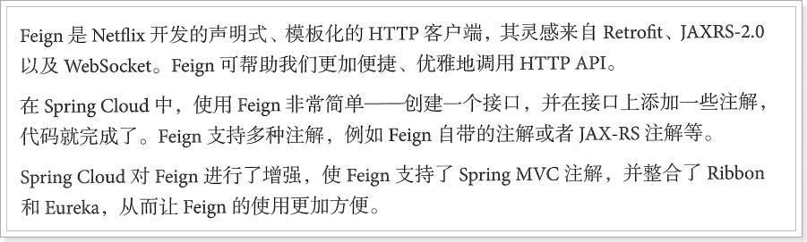

# 2.Feign

在前面的学习中, 我们使用了Ribbon的负载均衡功能, 大大简化了远程调用时的代码: 

```
String baseUrl = "http://user-service/user/";
User user = this.restTemplate.getForObject(baseUrl + id, User.class)
```

如果就学到这里, 你可能以后需要编写类似的大量重复代码, 格式基本相同, 无非参数不一样。有没有更优雅的方式, 来对这些代码再次优化呢？

这就是我们接下来要学的Feign的功能了。

## 2.1.简介


为什么叫伪装？

Feign可以把Rest的请求进行隐藏, 伪装成类似SpringMVC的Controller一样。你不用再自己拼接url, 拼接参数等等操作, 一切都交给Feign去做。




## 2.2.快速入门

### 2.2.1.导入依赖

```xml
<dependency>
    <groupId>org.springframework.cloud</groupId>
    <artifactId>spring-cloud-starter-openfeign</artifactId>
</dependency>
```

### 2.2.2.Feign的客户端

```
@FeignClient("user-service")
public interface UserFeignClient {

    @GetMapping("/user/{id}")
    User queryUserById(@PathVariable("id") Long id);
}
```

- 首先这是一个接口, Feign会通过动态代理, 帮我们生成实现类。这点跟mybatis的mapper很像
- `@FeignClient`, 声明这是一个Feign客户端, 类似`@Mapper`注解。同时通过`value`属性指定服务名称
- 接口中的定义方法, 完全采用SpringMVC的注解, Feign会根据注解帮我们生成URL, 并访问获取结果

改造原来的调用逻辑, 不再调用UserDao: 

```
@Service
public class UserService {

    @Autowired
    private UserFeignClient userFeignClient;

    public List<User> queryUserByIds(List<Long> ids) {
        List<User> users = new ArrayList<>();
        ids.forEach(id -> {
            // 我们测试多次查询, 
            users.add(this.userFeignClient.queryUserById(id));
        });
        return users;
    }
}
```

### 2.2.3.开启Feign功能

我们在启动类上, 添加注解, 开启Feign功能

```
@SpringBootApplication
@EnableDiscoveryClient
@EnableHystrix
@EnableFeignClients // 开启Feign功能
public class UserConsumerDemoApplication {
    public static void main(String[] args) {
        SpringApplication.run(UserConsumerDemoApplication.class, args);
    }
}
```

- 你会发现RestTemplate的注册被我删除了。Feign中已经自动集成了Ribbon负载均衡, 因此我们不需要自己定义RestTemplate了

## 2.3.负载均衡

Feign中本身已经集成了Ribbon依赖和自动配置


因此我们不需要额外引入依赖, 也不需要再注册`RestTemplate`对象。

另外, 我们可以像上节课中讲的那样去配置Ribbon, 可以通过`ribbon.xx`来进行全局配置。也可以通过`服务名.ribbon.xx`来对指定服务配置: 

```yaml
user-service:
  ribbon:
    ConnectTimeout: 250 # 连接超时时间(ms)
    ReadTimeout: 1000 # 通信超时时间(ms)
    OkToRetryOnAllOperations: true # 是否对所有操作重试
    MaxAutoRetriesNextServer: 1 # 同一服务不同实例的重试次数
    MaxAutoRetries: 1 # 同一实例的重试次数
```

## 2.4.Hystrix支持

Feign默认也有对Hystrix的集成

只不过, 默认情况下是关闭的。我们需要通过下面的参数来开启: 

```yaml
feign:
  hystrix:
    enabled: true # 开启Feign的熔断功能
```

但是, Feign中的Fallback配置不像Ribbon中那样简单了。

1)首先, 我们要定义一个类, 实现刚才编写的UserFeignClient, 作为fallback的处理类

```
@Component
public class UserFeignClientFallback implements UserFeignClient {
    @Override
    public User queryUserById(Long id) {
        User user = new User();
        user.setId(id);
        user.setName("用户查询出现异常！");
        return user;
    }
}

```

2)然后在UserFeignClient中, 指定刚才编写的实现类

```
@FeignClient(value = "user-service", fallback = UserFeignClientFallback.class)
public interface UserFeignClient {

    @GetMapping("/user/{id}")
    User queryUserById(@PathVariable("id") Long id);
}

```
