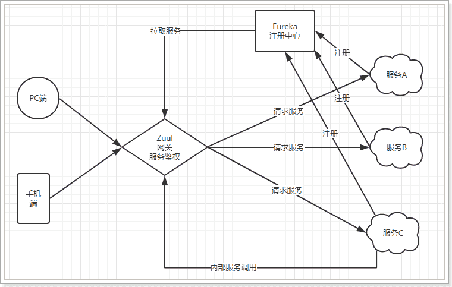

# Zuul网关

服务网关是微服务架构中一个不可或缺的部分。通过服务网关统一向外系统提供REST API的过程中, 除了具备服务路由、均衡负载功能之外, 它还具备了`权限控制`等功能。Spring Cloud Netflix中的Zuul就担任了这样的一个角色, 为微服务架构提供了前门保护的作用, 同时将权限控制这些较重的非业务逻辑内容迁移到服务路由层面, 使得服务集群主体能够具备更高的可复用性和可测试性。

## Zuul加入后的架构



- 不管是来自于客户端(PC或移动端)的请求, 还是服务内部调用。一切对服务的请求都会经过Zuul这个网关, 然后再由网关来实现 鉴权、动态路由等等操作。Zuul就是我们服务的统一入口。

## 快速入门

### 新建工程

添加Zuul依赖
```xml
<dependency>
    <groupId>org.springframework.cloud</groupId>
    <artifactId>spring-cloud-starter-zuul</artifactId>
</dependency>
```

### 编写启动类

通过`@EnableZuulProxy `注解开启Zuul的功能: 
```java
@SpringBootApplication
@EnableZuulProxy // 开启Zuul的网关功能
public class ZuulDemoApplication {

	public static void main(String[] args) {
		SpringApplication.run(ZuulDemoApplication.class, args);
	}
}
```

### 编写配置

```yaml
server:
  port: 10010 #服务端口
spring: 
  application:  
    name: api-gateway #指定服务名
```

### 编写路由规则

我们需要用Zuul来代理user-service服务, 先看一下控制面板中的服务状态: 

- ip为: 127.0.0.1
- 端口为: 8081

映射规则: 
```yaml
zuul:
  routes:
    user-service: # 这里是路由id, 随意写
      path: /user-service/** # 这里是映射路径
      url: http://127.0.0.1:8081 # 映射路径对应的实际url地址
```

我们将符合`path` 规则的一切请求, 都代理到 `url`参数指定的地址

本例中, 我们将 `/user-service/**`开头的请求, 代理到http://127.0.0.1:8081

### 启动测试: 

访问的路径中需要加上配置规则的映射路径, 我们访问: http://127.0.0.1:8081/user-service/user/10

## 面向服务的路由

在刚才的路由规则中, 我们把路径对应的服务地址写死了！如果同一服务有多个实例的话, 这样做显然就不合理了。

我们应该根据服务的名称, 去Eureka注册中心查找 服务对应的所有实例列表, 然后进行动态路由才对！

### 添加Eureka客户端依赖

```xml
<dependency>
    <groupId>org.springframework.cloud</groupId>
    <artifactId>spring-cloud-starter-netflix-eureka-client</artifactId>
</dependency>
```

### 开启Eureka客户端发现功能

```java
@SpringBootApplication
@EnableZuulProxy // 开启Zuul的网关功能
@EnableDiscoveryClient
public class ZuulDemoApplication {

	public static void main(String[] args) {
		SpringApplication.run(ZuulDemoApplication.class, args);
	}
}
```

### 添加Eureka配置, 获取服务信息

```yaml
eureka:
  client:
    registry-fetch-interval-seconds: 5 # 获取服务列表的周期: 5s
    service-url:
      defaultZone: http://127.0.0.1:10086/eureka
  instance:
    prefer-ip-address: true
    ip-address: 127.0.0.1
```

### 修改映射配置, 通过服务名称获取

因为已经有了Eureka客户端, 我们可以从Eureka获取服务的地址信息, 因此映射时无需指定IP地址, 而是通过服务名称来访问, 而且Zuul已经集成了Ribbon的负载均衡功能。

```yaml
zuul:
  routes:
    user-service: # 这里是路由id, 随意写
      path: /user-service/** # 这里是映射路径
      serviceId: user-service # 指定服务名称
```

## 简化的路由配置

在刚才的配置中, 我们的规则是这样的: 

- `zuul.routes.<route>.path=/xxx/**`:  来指定映射路径。`<route>`是自定义的路由名
- `zuul.routes.<route>.serviceId=/user-service`: 来指定服务名。

而大多数情况下, 我们的`<route>`路由名称往往和 服务名会写成一样的。因此Zuul就提供了一种简化的配置语法: `zuul.routes.<serviceId>=<path>`

比方说上面我们关于user-service的配置可以简化为一条: 

```yaml
zuul:
  routes:
    user-service: /user-service/** # 这里是映射路径
```

省去了对服务名称的配置。

## 默认的路由规则

在使用Zuul的过程中, 上面讲述的规则已经大大的简化了配置项。但是当服务较多时, 配置也是比较繁琐的。因此Zuul就指定了默认的路由规则: 

- 默认情况下, 一切服务的映射路径就是服务名本身。
  - 例如服务名为: `user-service`, 则默认的映射路径就是: `/user-service/**`

也就是说, 刚才的映射规则我们完全不配置也是OK的, 不信就试试看。

## 路由前缀

配置示例: 

```yaml
zuul:
  prefix: /api # 添加路由前缀
  routes:
      user-service: # 这里是路由id, 随意写
        path: /user-service/** # 这里是映射路径
        service-id: user-service # 指定服务名称
```

我们通过`zuul.prefix=/api`来指定了路由的前缀, 这样在发起请求时, 路径就要以/api开头。

路径`/api/user-service/user/1`将会被代理到`/user-service/user/1`

## 过滤器

Zuul作为网关的其中一个重要功能, 就是实现请求的鉴权。而这个动作我们往往是通过Zuul提供的过滤器来实现的。

### ZuulFilter

ZuulFilter是过滤器的顶级父类。在这里我们看一下其中定义的4个最重要的方法: 

```java
public abstract ZuulFilter implements IZuulFilter{

    abstract public String filterType();

    abstract public int filterOrder();
    
    boolean shouldFilter();// 来自IZuulFilter

    Object run() throws ZuulException;// IZuulFilter
}
```

- `shouldFilter`: 返回一个`Boolean`值, 判断该过滤器是否需要执行。返回true执行, 返回false不执行。
- `run`: 过滤器的具体业务逻辑。
- `filterType`: 返回字符串, 代表过滤器的类型。包含以下4种: 
  - `pre`: 请求在被路由之前执行
  - `routing`: 在路由请求时调用
  - `post`: 在routing和errror过滤器之后调用
  - `error`: 处理请求时发生错误调用
- `filterOrder`: 通过返回的int值来定义过滤器的执行顺序, 数字越小优先级越高。


### 过滤器执行生命周期: 

正常流程: 
- 请求到达首先会经过pre类型过滤器, 而后到达routing类型, 进行路由, 请求就到达真正的服务提供者, 执行请求, 返回结果后, 会到达post过滤器。而后返回响应。

异常流程: 
- 整个过程中, pre或者routing过滤器出现异常, 都会直接进入error过滤器, 再error处理完毕后, 会将请求交给POST过滤器, 最后返回给用户。
- 如果是error过滤器自己出现异常, 最终也会进入POST过滤器, 而后返回。
- 如果是POST过滤器出现异常, 会跳转到error过滤器, 但是与pre和routing不同的时, 请求不会再到达POST过滤器了。

### 使用场景

场景非常多: 

- 请求鉴权: 一般放在pre类型, 如果发现没有访问权限, 直接就拦截了
- 异常处理: 一般会在error类型和post类型过滤器中结合来处理。
- 服务调用时长统计: pre和post结合使用。

## 自定义过滤器

接下来我们来自定义一个过滤器, 模拟一个登录的校验。基本逻辑: 如果请求中有access-token参数, 则认为请求有效, 放行。

### 定义过滤器类

```java
@Component
public class LoginFilter extends ZuulFilter{
    @Override
    public String filterType() {
        // 登录校验, 肯定是在前置拦截
        return "pre";
    }

    @Override
    public int filterOrder() {
        // 顺序设置为1
        return 1;
    }

    @Override
    public boolean shouldFilter() {
        // 返回true, 代表过滤器生效。
        return true;
    }

    @Override
    public Object run() throws ZuulException {
        // 登录校验逻辑。
        // 1)获取Zuul提供的请求上下文对象
        RequestContext ctx = RequestContext.getCurrentContext();
        // 2) 从上下文中获取request对象
        HttpServletRequest req = ctx.getRequest();
        // 3) 从请求中获取token
        String token = req.getParameter("access-token");
        // 4) 判断
        if(token == null || "".equals(token.trim())){
            // 没有token, 登录校验失败, 拦截
            ctx.setSendZuulResponse(false);
            // 返回401状态码。也可以考虑重定向到登录页。
            ctx.setResponseStatusCode(HttpStatus.UNAUTHORIZED.value());
        }
        // 校验通过, 可以考虑把用户信息放入上下文, 继续向后执行
        return null;
    }
}
```

## 负载均衡和熔断

Zuul中默认就已经集成了Ribbon负载均衡和Hystrix熔断机制。但是所有的超时策略都是走的默认值, 比如熔断超时时间只有1S, 很容易就触发了。因此建议我们手动进行配置: 

```yaml
zuul:
  retryable: true
ribbon:
  ConnectTimeout: 250 # 连接超时时间(ms)
  ReadTimeout: 2000 # 通信超时时间(ms)
  OkToRetryOnAllOperations: true # 是否对所有操作重试
  MaxAutoRetriesNextServer: 2 # 同一服务不同实例的重试次数
  MaxAutoRetries: 1 # 同一实例的重试次数
hystrix:
  command:
  	default:
        execution:
          isolation:
            thread:
              timeoutInMillisecond: 6000 # 熔断超时时长: 6000ms
```
