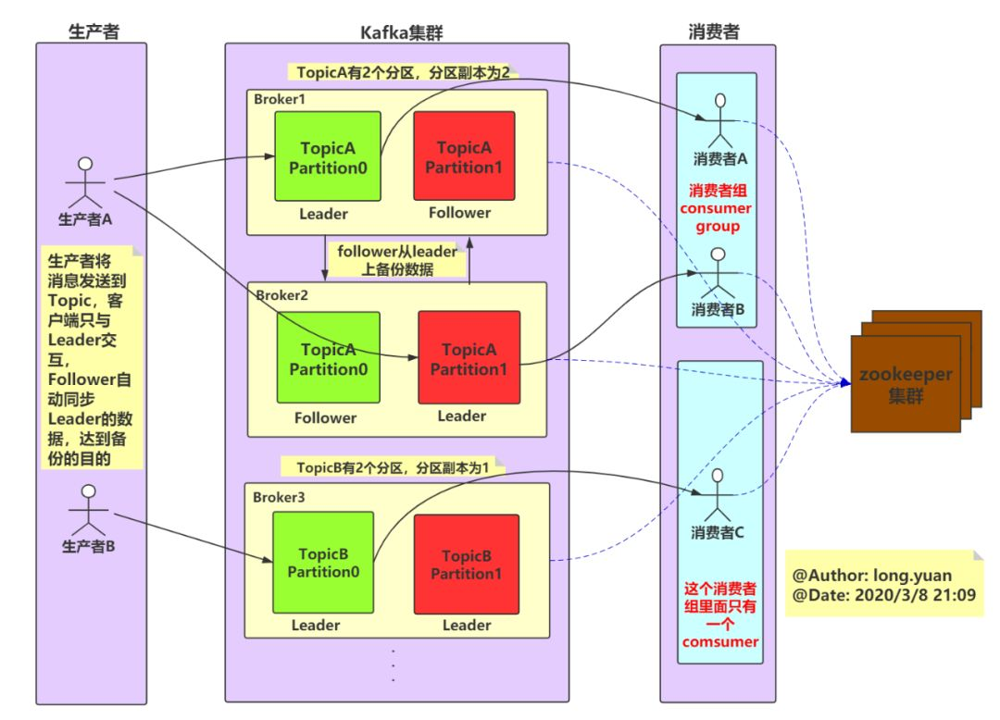

# kafka架构

# broker

kafka 集群包含一个或多个服务器，每个服务器节点称为一个broker。

# topic

每条发布到kafka集群的消息都有一个类别，这个类别称为topic，其实就是将消息按照topic来分类，topic就是逻辑上的分类，同一个topic的数据既可以在同一个broker上也可以在不同的broker结点上。

# partition

每个topic被物理划分为一个或多个分区，每个分区在物理上对应一个文件夹，该文件夹里面存储了这个分区的所有消息和索引文件。在创建topic时可指定parition数量，生产者将消息发送到topic时，消息会根据 分区策略 追加到分区文件的末尾，属于顺序写磁盘，因此效率非常高（经验证，顺序写磁盘效率比随机写内存还要高，这是Kafka高吞吐率的一个很重要的保证）。

分区策略是决定生产者将消息发送到哪个分区的算法。Kafka 为我们提供了默认的分区策略，同时它也支持自定义分区策略。kafka允许为每条消息设置一个key，一旦消息被定义了 Key，那么就可以保证同一个 Key 的所有消息都进入到相同的分区，这种策略属于自定义策略的一种，被称作"按消息key保存策略"，或Key-ordering 策略。

同一topic的多个分区可以部署在多个机器上，以此来实现 kafka 的伸缩性。同一partition中的数据是有序的，但topic下的多个partition之间在消费数据时不能保证有序性，在需要严格保证消息顺序消费的场景下，可以将partition数设为1，但这种做法的缺点是降低了吞吐，一般来说，只需要保证每个分区的有序性，再对消息设置key来保证相同key的消息落入同一分区，就可以满足绝大多数的应用。

# offset

partition中的每条消息都被标记了一个序号，这个序号表示消息在partition中的偏移量，称为offset，每一条消息在partition都有唯一的offset，消息者通过指定offset来指定要消费的消息。

正常情况下，消费者在消费完一条消息后会递增offset，准备去消费下一条消息，但也可以将offset设成一个较小的值，重新消费一些消费过的消息，offset是由consumer控制的，consumer想消费哪一条消息就消费哪一条消息，所以kafka broker是无状态的，它不需要标记哪些消息被消费过。

# producer

生产者发送消息到指定的topic下，消息再根据分配规则append到某个partition的末尾。

# consumer

消费者从topic中消费数据。

# consumer group

每个consumer属于一个特定的consumer group，可为每个consumer指定consumer group，若不指定则属于默认的group。

同一topic的一条消息只能被同一个consumer group内的一个consumer消费，但多个consumer group可同时消费这一消息。这也是kafka用来实现一个topic消息的广播和单播的手段，如果需要实现广播，一个consumer group内只放一个消费者即可，要实现单播，将所有的消费者放到同一个consumer group即可。

# leader

每个partition有多个副本，其中有且仅有一个作为leader，leader会负责所有的客户端读写操作。

# follower

follower不对外提供服务，只与leader保持数据同步，如果leader失效，则选举一个follower来充当新的leader。

所有与leader副本保持一定程度同步的副本（包括Leader）组成ISR（In-Sync Replicas）。

当follower与leader挂掉、卡住或者同步太慢，leader会把这个follower从ISR列表中删除，重新创建一个follower。
