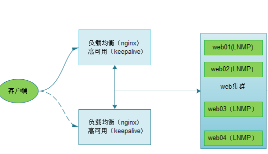

# keepalived配置



/etc/keepalived/keepalived.conf

# keepalived主

```ini
! Configuration File for keepalived
global_defs {
    router_id lb02 #标识信息，一个名字而已；
}
vrrp_instance VI_1 {
    state MASTER    #角色是master
    interface eth0  #vip 绑定端口
    virtual_router_id 50    #让master 和backup在同一个虚拟路由里，id 号必须相同；
    priority 150            #优先级,谁的优先级高谁就是master ;
    advert_int 1            #心跳间隔时间
    authentication {
        auth_type PASS      #认证
        auth_pass 1111      #密码 
}
    virtual_ipaddress {
        10.0.0.3            #虚拟ip
    }
}
```

# keepalived备

```conf
! Configuration File for keepalived
global_defs {     
    router_id lb02   
}
 
vrrp_instance VI_1 {
    state BACKUP
    interface eth0
    virtual_router_id 50
    priority 100
    advert_int 1
    authentication {
        auth_type PASS
        auth_pass 1111
}
    virtual_ipaddress {
        10.0.0.3
    }
}
```

