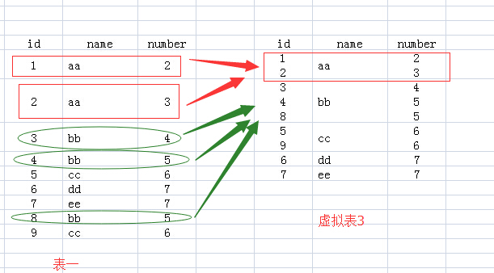
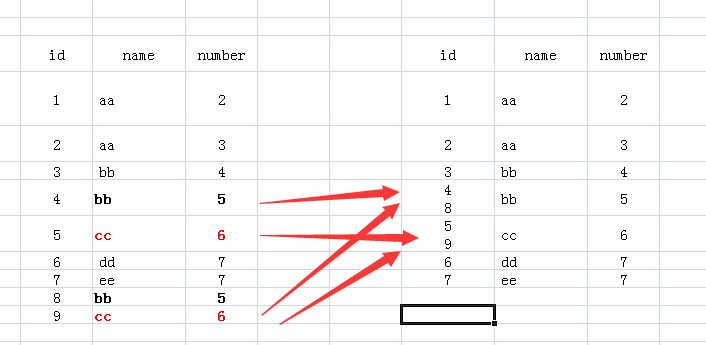

# 聚合函数:将一列数据作为一个整体, 进行纵向的计算
1. count:计算个数
2. max:计算最大值
3. min:计算最小值
4. sum:计算和
5. avg:计算平均值
6. group_concat: 将group by产生的同一个分组中的值连接起来，返回一个字符串结果。语法：`group_concat( [distinct] 要连接的字段 [order by 排序字段 asc/desc ] [separator '分隔符'] )`

分组之后能查询的字段只有分组字段和聚合函数

# where 和 having 的区别

* where 在分组之前进行限定, 如果不满足条件, 则不参与分组
* having在分组之后进行限定, 如果不满足结果, 则不会被查询出来
* where 后不可以跟聚合函数, having可以进行聚合函数的判断

# 例子

按照性别分组
```sql
-- 分别查询男女同学的平均分,人数 
-- 分数低于70分的人, 不参与分组,
-- 只查看分组之后人数大于2个人的数据
SELECT sex,AVG(math),COUNT(id) 
FROM student 
WHERE math>70 
GROUP BY sex 
HAVING COUNT(id)>2;
```

## 分析

执行如下SQL语句：`SELECT name FROM test GROUP BY name`

1.`FROM test`：该句执行后，结果就是原来的表。

2.`FROM test Group BY name`：该句执行后，我们想象生成了虚拟表3，生成过程是这样的：`group by name`，那么找name那一列，具有相同name值的行，合并成一行，所有的id值和number值写到一个单元格里面。



3.接下来就要针对虚拟表3执行Select语句了：

（1）如果执行`select *`的话，那么返回的结果应该是虚拟表3，可是id和number中有的单元格里面的内容是多个值的，而关系数据库就是基于关系的，单元格中是不允许有多个值的，所以执行`select * `语句就报错了。

（2）name列每个单元格只有一个数据，所以`select name`的话，就没有问题了。为什么name列每个单元格只有一个值呢，因为我们就是用name列来group by的。

（3）对于id和number里面的单元格有多个数据的情况就要用聚合函数，聚合函数就用来输入多个数据，输出一个数据的。如cout(id)，sum(number)，而每个聚合函数的输入就是每一个多数据的单元格。

（4）例如执行`select name,sum(number) from test group by name`，那么sum就对虚拟表3的number列的每个单元格进行sum操作，例如对name为aa的那一行的number列执行sum操作，即2+3，返回5

（5）group by 多个字段该怎么理解呢：如`group by name,number`，我们可以把name和number 看成一个整体字段，以他们整体来进行分组。



mysql对group by 进行了非ANSI标准的扩展，允许select后含有非group by 的列。
