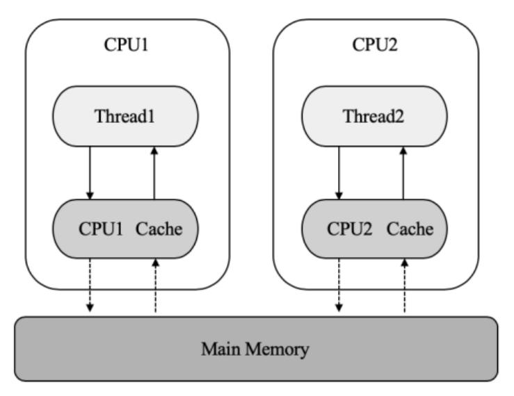
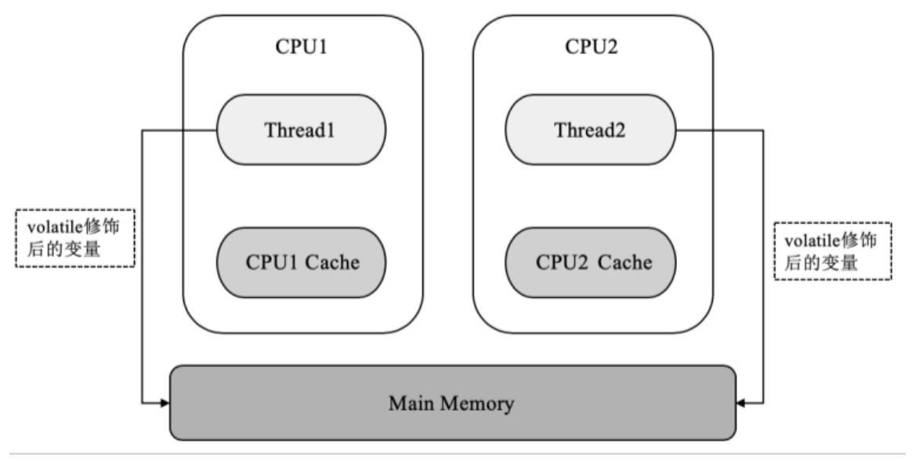

volatile变量具备两种特性：一种是保证该变量对所有线程可见，在一个线程修改了变量的值后，新的值对于其他线程是可以立即获取的；一种是volatile禁止指令重排，即volatile变量不会被缓存在寄存器中或者对其他处理器不可见的地方，因此在读取volatile类型的变量时总会返回最新写入的值。

因为在访问volatile变量时不会执行加锁操作，也就不会执行线程阻塞，因此volatile变量是一种比synchronized关键字更轻量级的同步机制。

volatile关键字可以严格保障变量的单次读、写操作的原子性，但并不能保证像i++这种操作的原子性，因为i++在本质上是读、写两次操作。

在有多个线程对普通变量进行读写时，每个线程都首先需要将数据从内存中复制变量到CPU缓存中，如果计算机有多个CPU，则线程可能都在不同的CPU中被处理，这意味着每个线程都需要将同一个数据复制到不同的CPU Cache中，这样在每个线程都针对同一个变量的数据做了不同的处理后就可能存在数据不一致的情况。

如果将变量声明为volatile，JVM就能保证每次读取变量时都直接从内存中读取，跳过CPU Cache这一步，有效解决了多线程数据同步的问题。

