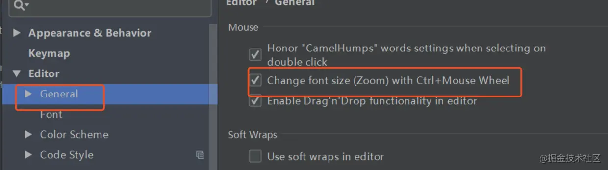
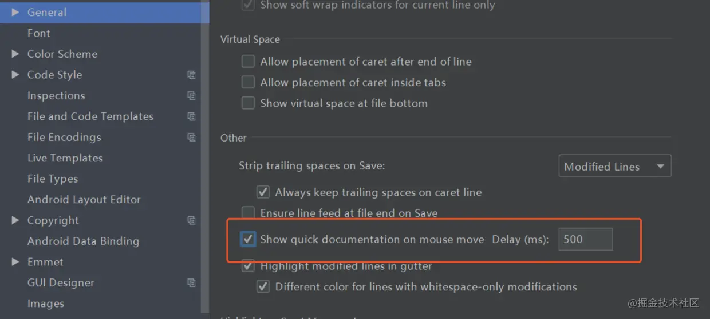
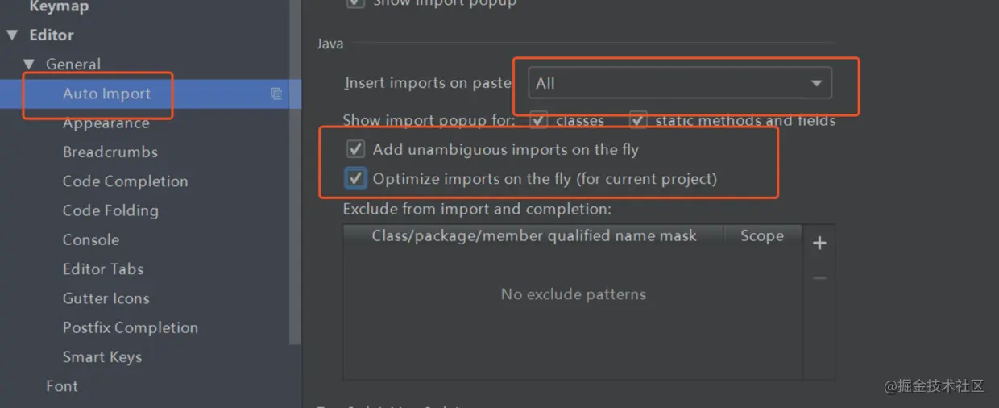
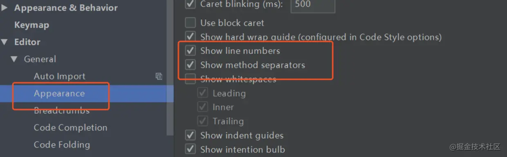
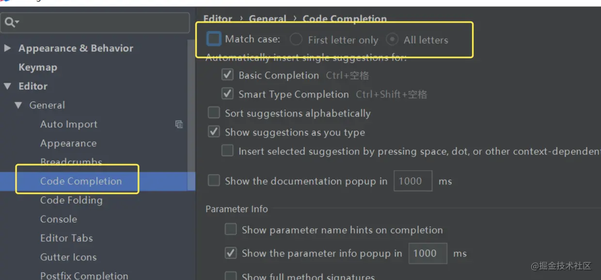
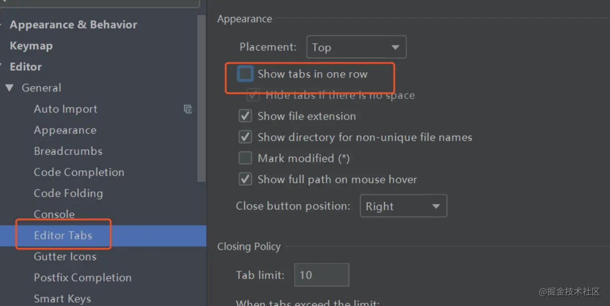
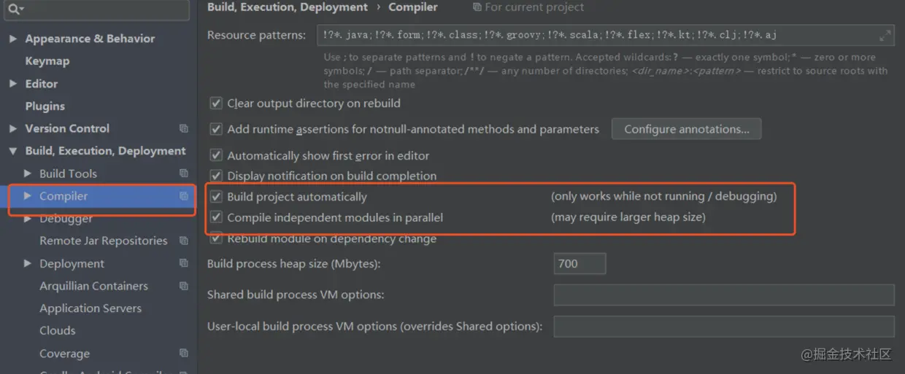

# 设置鼠标滚轮滚动修改字体大小

# 设置鼠标悬浮提示

# 设置自动导包

# 设置显示行号和方法间的分隔线

# 忽略代码提示大小写

IntelliJ IDEA 的代码提示和补充功能有一个特性区分大小写:比如我们在 Java 代码文件中输入 stringBuffer， IntelliJ IDEA 默认是不会帮我们提示或是代码补充的，但是如果我们输入 StringBuffer 就可以进行代码提示和补充。

# 设置取消单行显示Editor标签页

# 设置自动编译

