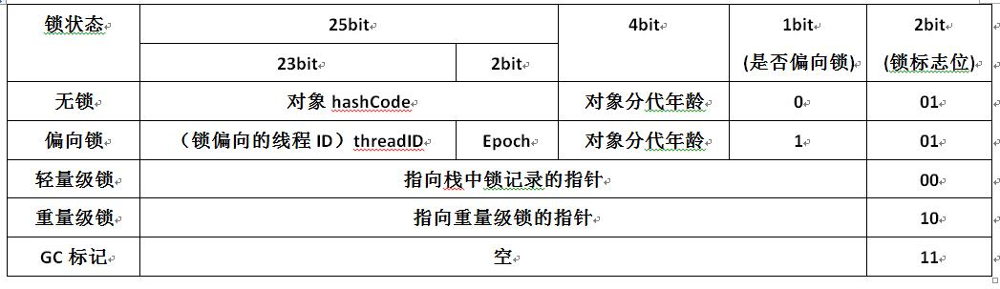

# Java对象头
由于Java面向对象的思想，在JVM中需要大量存储对象，存储时为了实现一些额外的功能，需要在对象中添加一些标记字段用于增强对象功能，这些标记字段组成了对象头。

## 普通对象
```
|--------------------------------------------------------------|
|                     Object Header (64 bits)                  |
|------------------------------------|-------------------------|
|        Mark Word (32 bits)         |    Klass Word (32 bits) |
|------------------------------------|-------------------------|
```
## 数组对象
```
|---------------------------------------------------------------------------------|
|                                 Object Header (96 bits)                         |
|--------------------------------|-----------------------|------------------------|
|        Mark Word(32bits)       |    Klass Word(32bits) |  array length(32bits)  |
|--------------------------------|-----------------------|------------------------|
```

## Mark Word

在32位的虚拟机中的Mark Word:



# 锁的4种状态

synchronized通过Monitor来实现线程同步，Monitor是依赖于底层的操作系统的Mutex Lock（互斥锁）来实现的线程同步。这种依赖于操作系统Mutex Lock所实现的锁称为“重量级锁”，JDK 6中为了减少获得锁和释放锁带来的性能消耗，引入了“偏向锁”和“轻量级锁”。

目前锁一共有4种状态，级别从低到高依次是：无锁、偏向锁、轻量级锁和重量级锁。锁状态只能升级不能降级。

## 无锁

程序不会有锁的竞争。这种情况不需要加锁，所以这种情况下对象锁状态为无锁。

## 偏向锁

偏向锁是指一段同步代码一直被一个线程所访问，那么该线程会自动获取锁，降低获取锁的代价。

偏向锁的执行流程如下：

1. 线程首先检查该对象头的线程ID是否为当前线程
2. 如果对象头的线程ID和当前线程ID一致，则直接执行代码
3. 如果不是当前线程ID，则使用CAS方式替换对象头中的线程ID
4. 如果使用CAS替换不成功则说明有线程正在执行，存在锁的竞争，这时需要撤销偏向锁，升级为轻量级锁
5. 如果CAS替换成功，则把对象头的线程ID改为自己的线程ID，然后执行代码

偏向锁只有遇到其他线程尝试竞争偏向锁时，持有偏向锁的线程才会释放锁，线程不会主动释放偏向锁。偏向锁的撤销，需要等待全局安全点（在这个时间点上没有字节码正在执行），它会首先暂停拥有偏向锁的线程，判断锁对象是否执行完同步代码块，决定撤销偏向锁后恢复到无锁还是轻量级锁的状态。

## 轻量级锁

当锁是偏向锁的时候，被另外的线程所访问，偏向锁就会升级为轻量级锁，其他线程会通过自旋的形式尝试获取锁，不会阻塞，从而提高性能。因为使用自旋的方式非常消耗CPU，当一定时间内通过自旋的方式无法获取到锁，或者一个线程在持有锁，一个在自旋，又有第三个来访时，轻量级锁升级为重量级锁。

## 重量级锁

升级为重量级锁时，锁标志的状态值变为“10”，此时Mark Word中存储的是指向重量级锁的指针，此时等待锁的线程都会进入阻塞状态。这种同步方式的成本非常高，包括系统调用引起的内核态与用户态切换、线程阻塞造成的线程切换等。
