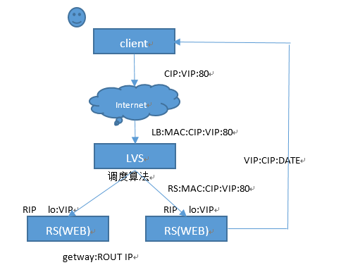

# DR 模式

客户端向目标vip发出请求,lvs接收 ，LVS根据负载均衡算法选择一台活跃的的节点，将此节点的ip所在网卡的mac地址作为目标mac地址,发送到局域网里

节点在局域网中收到这个帧,拆开后发现目标IP(VIP)与本地匹配,于是处理这个报文.随后重新封装报文,发送到局域网.此时IP包的目标ip是客户端，源ip是自己的vip地址。



# 环境

- LVS：VIP=10.211.102.47 DIP=172.16.100.10
- Nginx1：172.16.100.20
- Nginx2：172.16.100.30

# 负载均衡服务器配置

安装 ipvsadm 工具
```
yum install ipvsadm
```

配置vip服务
```
vim lvs_dr.sh
```

内容如下
```sh
vip=10.211.102.47
# Nginx服务器
rs1=172.16.100.20
rs2=172.16.100.30
/sbin/ipvsadm -C # 清除原有规则
/sbin/ipvsadm -A -t $vip:8088 -s rr # 添加vip:8088的tcp服务
/sbin/ipvsadm -a -t $vip:8088 -r $rs1:8088 -g # 添加rs1服务器
/sbin/ipvsadm -a -t $vip:8088 -r $rs2:8088 -g # 添加rs2服务器
```
执行脚本
```
/bin/bash lvs_dr.sh
```

查看服务配置情况
```
ipvsadm -ln -t 10.211.102.47:8088
```
输出
```
Prot LocalAddress:Port Scheduler Flags
-> RemoteAddress:Port Forward Weight ActiveConn InActConn
TCP 10.211.102.47:8088 rr
-> 172.16.100.20:8088 Route 1 0 0
-> 172.16.100.30:8088 Route 1 0 0
```

# Nginx服务器配置

配置 lo 和其它内核参数
```
vim rs_dr.sh
```

内容如下
```sh
vip=10.211.102.47
ifconfig lo:0 $vip broadcast $vip netmask 255.255.255.255 up
echo "1" >/proc/sys/net/ipv4/conf/lo/arp_ignore
echo "2" >/proc/sys/net/ipv4/conf/lo/arp_announce
echo "1" >/proc/sys/net/ipv4/conf/all/arp_ignore
echo "2" >/proc/sys/net/ipv4/conf/all/arp_announce
```

执行脚本
```
/bin/bash rs_dr.sh
```

查看lo:0接口配置信息
```
ifconfig lo:0
```
```
lo:0 Link encap:Local Loopback
inet addr:10.211.102.47 Mask:255.255.255.255
UP LOOPBACK RUNNING MTU:16436 Metric:1
```

# lo配置说明

如果服务器收到的数据包 IP 地址不是本机地址（没开启转发模式），就会丢弃。后端服务器收到 DR 模式的数据包，此时目标 IP 是 VIP，服务器会认为此数据包不是发送给本机的，会丢弃。而在 lo 接口上配置 VIP 后，服务器就能够正常接收此数据包，发送给相应的应用程序了。因此，在 lo 上配置 vip 能够完成接收数据包并将结果返回给客户端。
