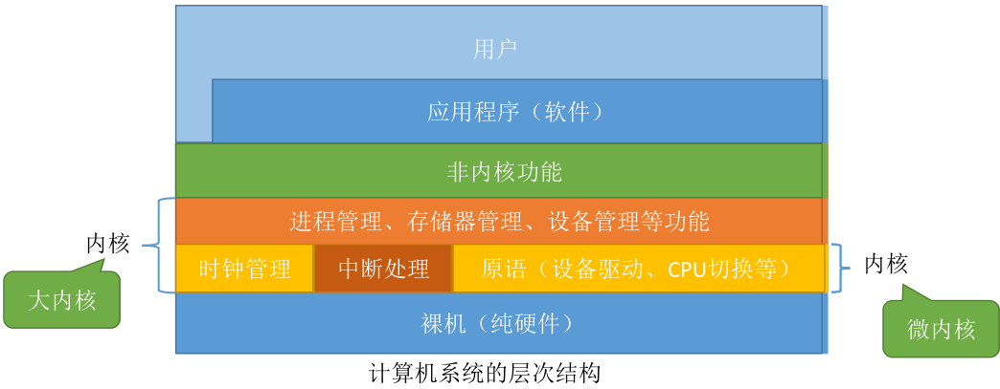

# 内核态与用户态

CPU 有两种状态，“内核态”和“用户态”

- 处于内核态时，说明此时正在运行的是内核程序，此时可以执行特权指令
- 处于用户态时，说明此时正在运行的是应用程序，此时只能执行非特权指令

CPU 中有一个寄存器叫 程序状态字寄存器（PSW），其中有个二进制位，1表示“内核态”，0表示“用户态”

- 内核态->用户态：执行一条特权指令修改PSW的标志位为“用户态”，这个动作意味着操作系统将主动让出CPU使用权
- 用户态->内核态：由“中断”引发，CPU检测到中断信号后，会立即变为“核心态”，并停止运行当前的应用程序，转而运行处理中断信号的内核程序

# 原语

原语是一种特殊的程序。是最接近硬件的部分，这种程序的运行具有原子性。即执行过程只能一气呵成，期间不允许被中断。

可以用 “关中断指令”和“开中断指令”这两个特权指令实现原子性。

正常情况下CPU每执行完一条指令都会例行检查是否有中断信号需要处理，如果有，则暂停运行当前这段程序，转而执行相应的中断处理程序。

CPU执行了关中断指令之后，就不再例行检查中断信号，直到执行开中断指令之后才会恢复检查。

# 大内核和微内核

- 大内核：高性能。内核代码大，结构混乱，难以维护
- 微内核：内核功能少，结构清晰，方便管理，更加稳定。因为需要频繁地在核心态和用户态之间进行切换，操作系统的执行开销偏大，性能低
