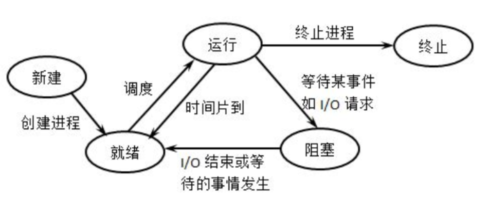

# 进程的状态

- 创建态：进程正在被创建时，它的状态是“创建态”，在这个阶段操作系统会为进程分配资源、初始化PCB
- 就绪态：当进程创建完成后，便进入“就绪态”，处于就绪态的进程已经具备运行条件，但由于没有空闲CPU，就暂时不能运行
- 运行态：当CPU空闲时，操作系统就会选择一个就绪进程，让它上处理机运行。如果一个进程此时在CPU上运行，那么这个进程处于“运行态”
- 阻塞态：在进程运行的过程中，可能会请求等待某个事件的发生（如等待某种系统资源的分配，或者等待其他进程的响应）。在这个事件发生之前，进程无法继续往下执行，此时操作系统会让这个进程下CPU，并让它进入“阻塞态”。当等待的事件发生时，进程从“阻塞态”回到“就绪态”
- 终止态：一个进程可以执行 exit 系统调用，请求操作系统终止该进程。此时该进程会进入“终止态”，操作系统会让该进程下CPU，并回收内存空间等资源，最后还要回收该进程的PCB。

# 进程状态的转换

单CPU情况下，同一时刻只会有一个进程处于运行态，多核CPU情况下，可能有多个进程处于运行态
