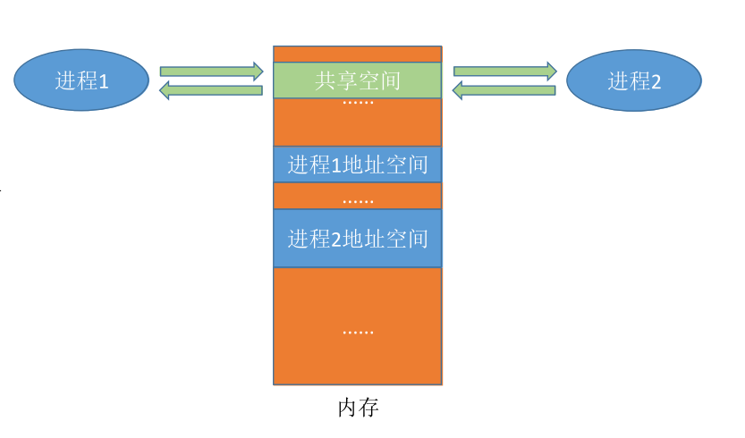

# 进程通信

进程是分配系统资源的单位，因此各进程拥有的内存地址空间相互独立。

为了保证安全，一个进程不能直接访问另一个进程的地址空间。但是进程之间的信息交换又是必须实现的。为了保证进程间的安全通信，操作系统提供了一些方法。

# 共享存储

基于数据结构的共享：比如共享空间里只能放一个长度为10的数组。这种共享方式速度慢、限制多。

基于存储区的共享：在内存中画出一块共享存储区，数据的形式、存放位置都由进程控制，而不是操作系统。这种共享方式速度更快。

两个进程对共享空间的访问必须是互斥的。

