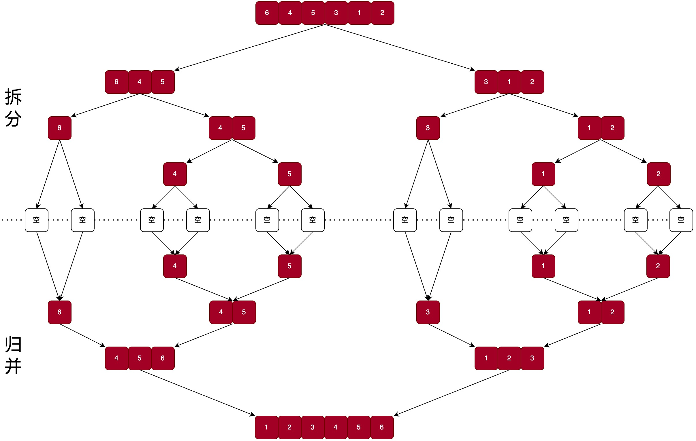

# 归并排序

归并排序(Merge Sort)是一种基于分治法(Divide and Conquer)的高效排序算法，其核心思想是 “先拆分、后合并”。

归并排序严格遵循 “分治” 三步法，每一步的逻辑清晰且固定:

1. 拆分(Divide): 将数组拆分为子数组
   1. 找到当前数组的中间索引，将数组分为左、右两个子数组
   2. 递归重复此过程，直到所有子数组的长度为 1 (长度为 1 的数组无需排序)
2. 合并(Merge): 将有序子数组合并为有序数组
   - 这是归并排序的核心步骤：给定两个已排序的子数组(左数组 A、右数组 B)，通过 “双指针比较” 将它们合并成一个新的有序数组

## 合并步骤

合并时需要使用一个临时数组。

将 `arr[left...mid]` 和 `arr[mid+1...right]` 合并:
