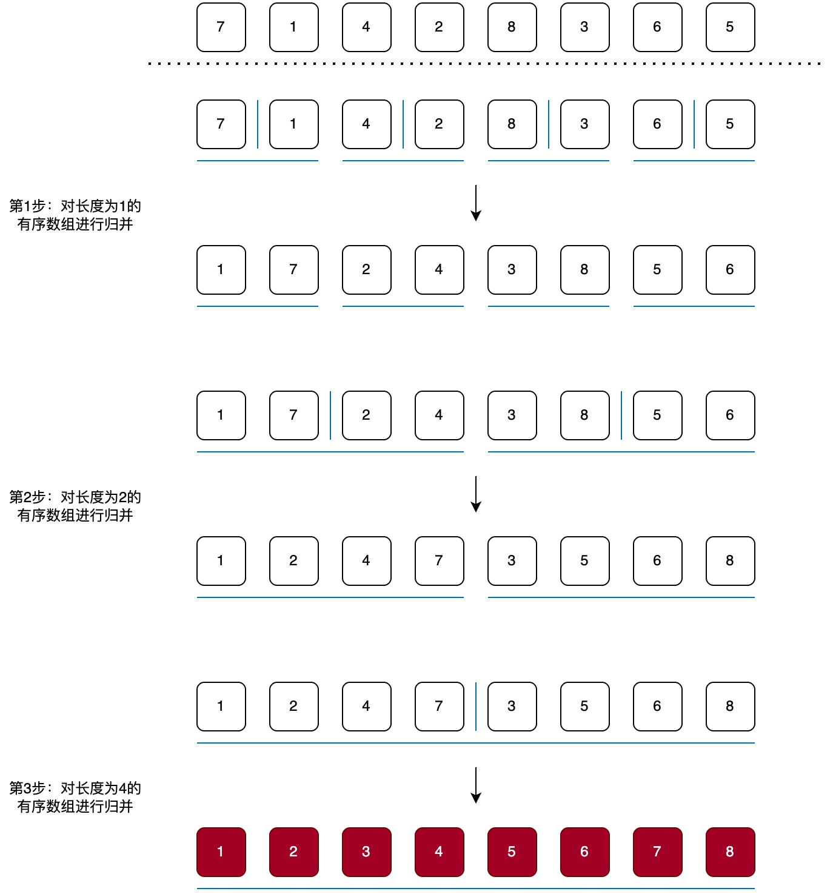
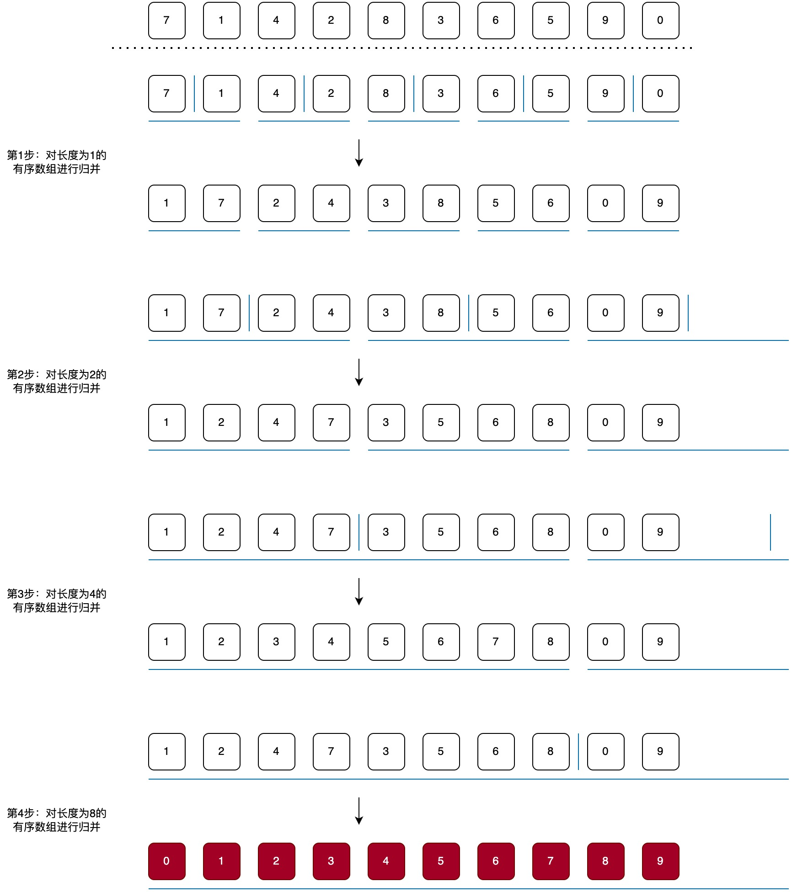

# 自底向上的归并排序



对于不能正好二分的数组, 同理:



```java
public static void sort(int[] data) {
    // size = 1: 第1步：对长度为1的有序数组进行归并
    // size = 2: 第2步：对长度为2的有序数组进行归并
    // size = 4: 第3步：对长度为4的有序数组进行归并
    // ...
    for (int size = 1; size < data.length; size++) {
        // 每一轮循环都会把两个长度为size的有序数组进行归并, 所以left每次增加size * 2
        // left + size是右数组的第一个元素的索引,
        // 如果left + size >= data.length,
        // 就表示右数组不存在了, 只有左数组, 所以就不需要归并了
        for (int left = 0; left + size < data.length; left += size * 2) {
            int mid = left + size - 1;
            int right = left + size * 2 - 1;
            // 保证right不会超过数组的边界
            right = Math.min(right, data.length - 1);
            // 合并data[left...mid]和data[mid+1...right]
            merge(data, left, mid, right);
        }
    }
}
```
