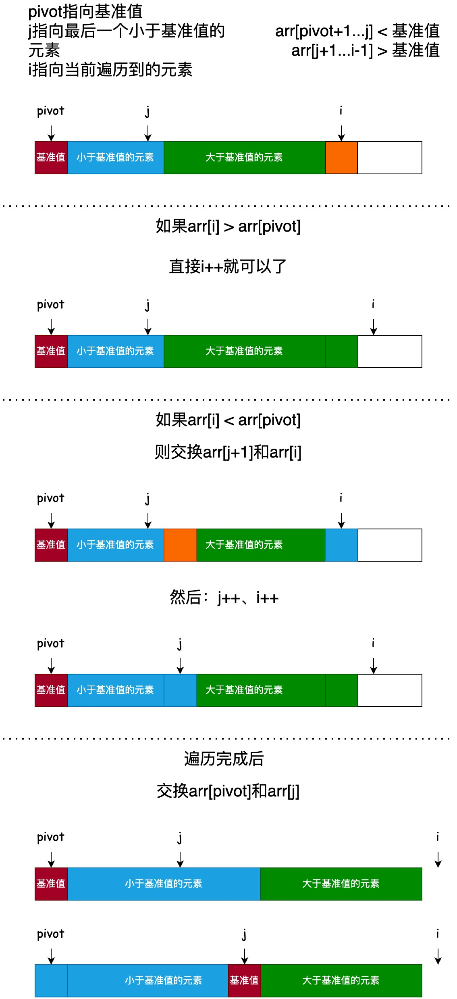

# 快速排序

快速排序的核心原理是分治法，通过一趟排序将待排数组分割成独立的两部分，其中一部分所有元素都比另一部分小，然后再按此方法对这两部分分别进行快速排序，递归执行直到整个数组有序。

核心步骤(以升序为例)

1. 选择基准值(pivot): 从待排序数组中任意选择一个元素作为 "基准值"，常见选择有数组第一个元素、最后一个元素或中间元素
2. 分区(partition): 重新排列数组，将所有比基准值小的元素放在基准值左边，所有比基准值大的元素放在基准值右边，基准值最终落在它应该在的位置上
3. 递归排序: 递归地将基准值左边的子数组和右边的子数组重复上述 "选基准 -> 分区" 的步骤，直到每个子数组只有一个元素或为空，此时数组完全有序

## partition 过程

