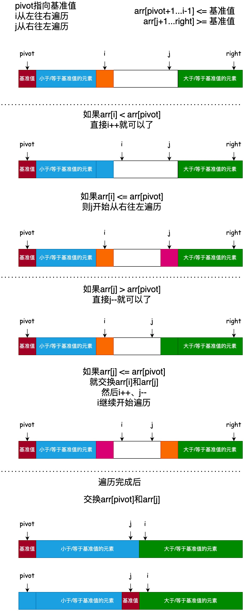

# 双路快速排序

双路快速排序主要解决了传统快速排序在处理大量重复元素数组时性能退化的问题。传统快速排序在当数组中存在大量重复元素时(比如所有元素都相等)，可能会导致划分出的两部分极度不平衡，从而使算法的时间复杂度退化为 O(n^2)。

双路快速排序通过双指针从数组两端向中间扫描，解决了普通快排面对重复元素时的性能退化问题，稳定性和效率更优。



```java
private static void partition2(int[] data, int left, int right) {
    if (left >= right) {
        return;
    }

    // 生成一个[left, right]之间的随机整数作为基准值的索引
    int pivot = left + (new Random()).nextInt(right - left + 1);
    // 将基准值放到数组的第一个位置
    swap(data, left, pivot);

    pivot = left;
    int i = pivot + 1;
    int j = right;
    // 循环不变量:
    // arr[pivot+1...i-1] <= 基准值
    // arr[j+1...right] >= 基准值
    while (true) {
        // 如果arr[i] < arr[pivot], 直接i++就可以了
        while (i <= j && data[i] < data[pivot]) {
            i++;
        }
        // 此时arr[i] >= arr[pivot], 或者i > j

        // 如果arr[j] > arr[pivot], 直接j--就可以了
        while (j >= i && data[j] > data[pivot]) {
            j--;
        }
        // 此时arr[j] <= arr[pivot], 或者j < i

        if (i >= j) {
            // [left, right]区间已经排序完成, 退出循环
            break;
        }
        // 交换arr[i]和arr[j]
        swap(data, i, j);
        i++;
        j--;
    }

    // 交换arr[pivot]和arr[j], 让基准值落在正确的位置
    swap(data, pivot, j);
    // 此时j指向的元素就是基准值, 它的左边都是小于等于它的元素, 右边都是大于它的元素

    // 递归排序arr[left...j-1]和arr[j+1...right]
    partition2(data, left, j - 1);
    partition2(data, j + 1, right);
}
```
