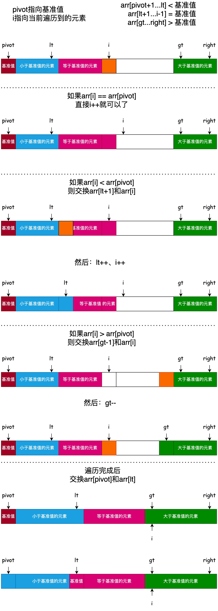

# 三路快速排序

三路快速排序和双路快速排序都是对基础快速排序的优化，核心差异在于如何处理数组中的重复元素。

三路快排直接将数组划分为「小于基准值」「等于基准值」「大于基准值」三部分。中间的 “等于” 区间无需参与后续递归，仅需对 “小于” 和 “大于” 区间排序。这使得重复元素被一次性 “剥离”，避免了对重复元素的反复比较和划分，大幅减少了递归次数和操作量。



```java
private static void partition3(int[] data, int left, int right) {
    if (left >= right) {
        return;
    }

    // 生成一个[left, right]之间的随机整数作为基准值的索引
    int pivot = left + (new Random()).nextInt(right - left + 1);
    // 将基准值放到数组的第一个位置
    swap(data, left, pivot);

    pivot = left;
    int i = pivot + 1;
    int lt = pivot;
    int gt = right + 1;
    // 循环不变量:
    // arr[pivot+1...lt] < 基准值
    // arr[lt+1...i-1] = 基准值
    // arr[gt...right] > 基准值
    while (true) {
        if (i == gt) {
            // [left, right]区间已经排序完成, 退出循环
            break;
        }
        // 如果arr[i] == arr[pivot], 直接i++就可以了
        if (data[i] == data[pivot]) {
            i++;
            continue;
        }
        // 如果arr[i] < arr[pivot], 则交换arr[lt+1]和arr[i]
        // 然后：lt++、i++
        if (data[i] < data[pivot]) {
            swap(data, lt + 1, i);
            lt++;
            i++;
            continue;
        }
        // 如果arr[i] > arr[pivot], 则交换arr[gt-1]和arr[i]
        // 然后：gt--
        if (data[i] > data[pivot]) {
            swap(data, gt - 1, i);
            gt--;
        }
    }

    // 交换arr[pivot]和arr[lt], 让基准值落在正确的位置
    swap(data, pivot, lt);
    // 此时lt指向的元素就是基准值, 它的左边都是小于等于它的元素, 右边都是大于它的元素

    // 递归排序arr[left...lt-1]和arr[gt...right]
    partition3(data, left, lt - 1);
    partition3(data, gt, right);
}
```
