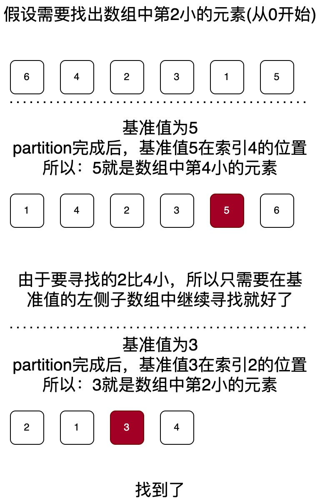

# Select K 问题

Select K 问题: 给出一个无序数组, 找出数组中第 K 小的元素。

解法: 每次 partition 完成后, 本次基准值所在的位置 i 就是数组中第 i 小的元素所在的位置(假设从 0 开始数)。



```java
import java.util.Random;

public class SelectK {

    /**
     * 交换数组data中索引为i和j的元素
     */
    private static void swap(int[] data, int i, int j) {
        int temp = data[i];
        data[i] = data[j];
        data[j] = temp;
    }

    private static int partition3(int[] data, int left, int right, int K) {
        if (left >= right) {
            // 数组只有一个元素, 它就是第K小的元素
            return data[left];
        }

        // 生成一个[left, right]之间的随机整数作为基准值的索引
        int pivot = left + (new Random()).nextInt(right - left + 1);
        // 将基准值放到数组的第一个位置
        swap(data, left, pivot);

        pivot = left;
        int i = pivot + 1;
        int lt = pivot;
        int gt = right + 1;
        // 循环不变量:
        // arr[pivot+1...lt] < 基准值
        // arr[lt+1...i-1] = 基准值
        // arr[gt...right] > 基准值
        while (true) {
            if (i == gt) {
                // [left, right]区间已经排序完成, 退出循环
                break;
            }
            // 如果arr[i] == arr[pivot], 直接i++就可以了
            if (data[i] == data[pivot]) {
                i++;
                continue;
            }
            // 如果arr[i] < arr[pivot], 则交换arr[lt+1]和arr[i]
            // 然后：lt++、i++
            if (data[i] < data[pivot]) {
                swap(data, lt + 1, i);
                lt++;
                i++;
                continue;
            }
            // 如果arr[i] > arr[pivot], 则交换arr[gt-1]和arr[i]
            // 然后：gt--
            if (data[i] > data[pivot]) {
                swap(data, gt - 1, i);
                gt--;
            }
        }

        // 交换arr[pivot]和arr[lt], 让基准值落在正确的位置
        swap(data, pivot, lt);

        // 此时lt指向的元素就是基准值, 它的左边都是小于等于它的元素, 右边都是大于它的元素

        if (lt == K) {
            // 基准值就是第K小的元素
            return data[lt];
        } else if (lt > K) {
            // 第K小的元素在左子数组中
            return partition3(data, left, lt - 1, K);
        } else {
            // 第K小的元素在右子数组中
            return partition3(data, gt, right, K);
        }
    }

    public static int selectK(int[] data, int K) {
        if (K < 1 || K > data.length) {
            throw new IllegalArgumentException("K must be between 1 and the length of the array");
        }
        return partition3(data, 0, data.length - 1, K);
    }

    /**
     * 测试用例
     */
    public static void main(String[] args) {
        // 数组中的元素不能重复, 否则会导致错误的结果
        int[] data = {6, 4, 2, 3, 1, 5};
        int K = 3;
        int target = selectK(data, K);
        System.out.println("第" + K + "小的元素是: " + target);
    }
}
```
