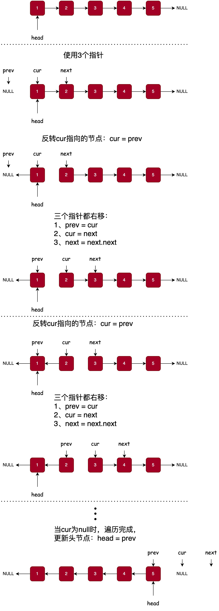

# 反转链表

[206. Reverse Linked List](https://leetcode.com/problems/reverse-linked-list/description/)

给你单链表的头节点 head ，请你反转链表，并返回反转后的链表。

示例 1：

```
输入：head = [1,2,3,4,5]
输出：[5,4,3,2,1]
```

示例 2：

```
输入：head = [1,2]
输出：[2,1]
```

示例 3：

```
输入：head = []
输出：[]
```

提示：

- 链表中节点的数目范围是 `[0, 5000]`
- -5000 <= Node.val <= 5000

进阶：链表可以选用迭代或递归方式完成反转。你能否用两种方法解决这道题？



```java
public class ReverseLinkedList {
    public ListNode reverseList(ListNode head) {
        ListNode pre = null;
        ListNode cur = head;
        while (cur != null) {
            ListNode next = cur.next;
            // 反转当前节点
            cur.next = pre;
            // 指针右移
            pre = cur;
            cur = next;
        }
        return pre;
    }

    /**
     * 测试方法
     */
    public static void main(String[] args) {
        ListNode head = new ListNode(1);
        head.next = new ListNode(2);
        head.next.next = new ListNode(3);
        head.next.next.next = new ListNode(4);
        head.next.next.next.next = new ListNode(5);
        ReverseLinkedList reverseLinkedList = new ReverseLinkedList();
        ListNode newHead = reverseLinkedList.reverseList(head);
        while (newHead != null) {
            System.out.println(newHead.val);
            newHead = newHead.next;
        }
    }
}
```
