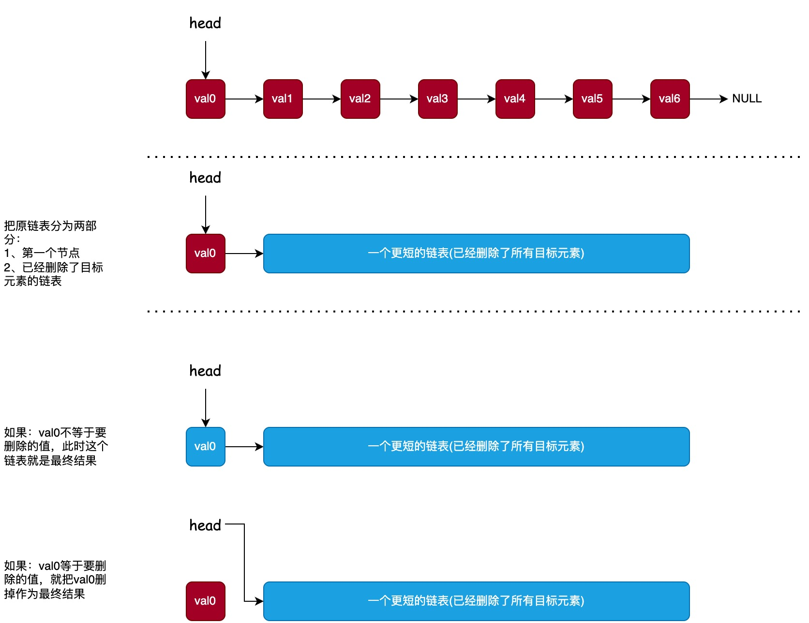

# 移除链表元素(递归)

设计递归的方式:



```java
public ListNode removeElements(ListNode head, int val) {
    // 求解最基本的问题
    if (head == null) {
        return null;
    }
    // 把原问题转化成更小的问题
    ListNode shorterLinkedList = removeElements(head.next, val);
    head.next = shorterLinkedList;

    if (head.val == val) {
        // 如果：head等于要删除的值，就把head删掉作为最终结果
        return shorterLinkedList;
    } else {
        // 如果：head不等于要删除的值，此时这个链表就是最终结果
        return head;
    }
}
```
