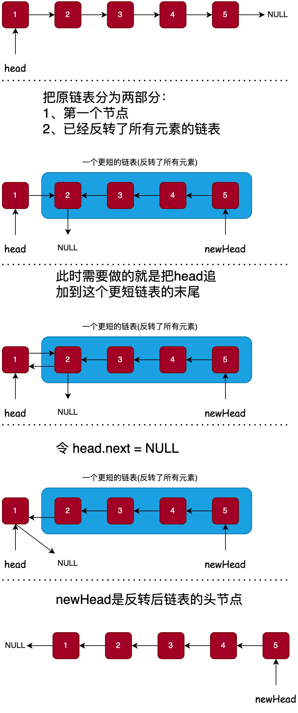

# 反转链表(递归)

设计递归的方式:



```java
public ListNode reverseList(ListNode head) {
    // 求解最基本的问题
    if (head == null || head.next == null) {
        // 空链表和只有一个节点的链表不需要反转
        return head;
    }
    // 把原问题转化成更小的问题
    ListNode newHead = reverseList(head.next);

    // head指向的节点就是反转后的子链表中最后一个节点
    ListNode tail = head.next;
    // 把head追加到这个更短链表的末尾
    tail.next = head;
    head.next = null;
    // newHead是反转后链表的头节点
    return newHead;
}
```
