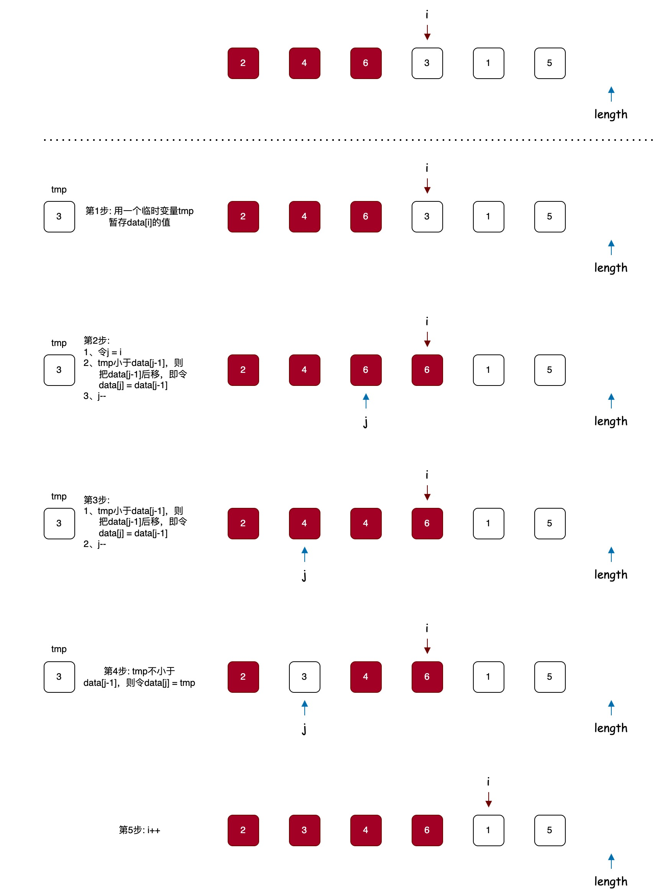

# 优化插入排序

优化: swap 方法中包含三个操作, 把使用 swap 改成赋值操作。



```java
public class InsertionSort {

    /**
     * 插入排序
     *
     * @param data 待排序的数组
     */
    public static void sort(int[] data) {
        // data[i...n) 是没有排序的
        // data[0...i) 是排好序的
        for (int i = 0; i < data.length; i++) {
            // 把data[i]保存到临时变量
            int tmp = data[i];
            int j = i;
            for (; j - 1 >= 0; j--) {
                // 注意这里是用data[i]和data[j-1]比较
                if (tmp < data[j - 1]) {
                    data[j] = data[j - 1];
                } else {
                    // data[j]已经在正确的位置了
                    break;
                }
            }
            // 把tmp插入到j的位置
            data[j] = tmp;
        }
    }

    /**
     * 测试方法
     */
    public static void main(String[] args) {
        int[] data = {6, 4, 2, 3, 1, 5};
        sort(data);
        for (int datum : data) {
            System.out.print(datum + " ");
        }
    }
}
```
