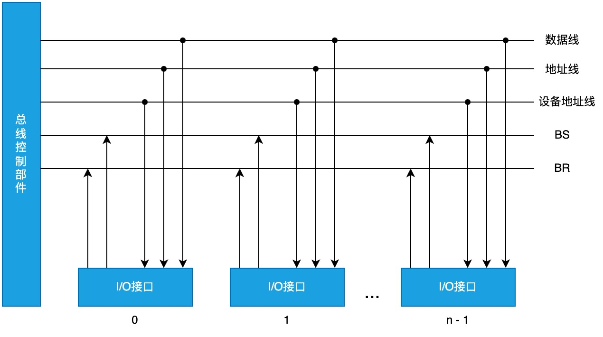
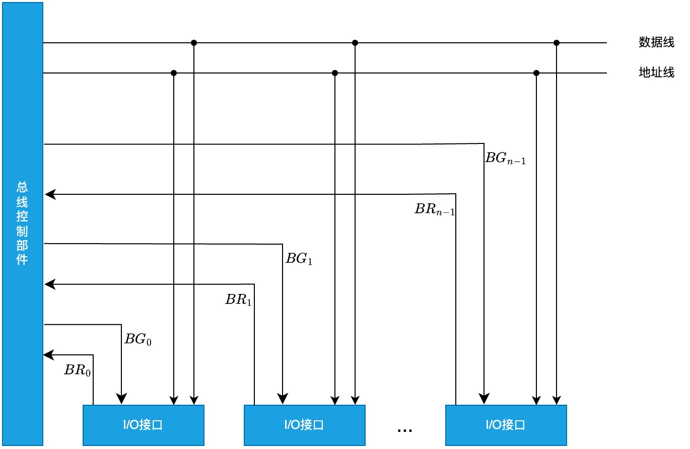

# 总线仲裁

## 集中仲裁方式

控制逻辑集中于 CPU 一处。

### 链式查询方式

- BS: 总线忙
- BR: 总线请求
- BG: 总线同意

工作流程:

1. 第二个 I/O 接口通过 BR 向总线控制部件发出总线请求(由于 BR 是共用的, 总线控制部件不知道具体是哪个部件发的请求)
2. 总线控制部件通过 BG 发出查询信号
3. 首先查询第一个 I/O 接口, 它没有发出总线请求
4. 然后查询第二个 I/O 接口, 它发出了总线请求
5. 检查 BS 判断是否有部件在使用总线, 如果没有, 则把总线分配给第二个 I/O 接口, 并设置 BS 为总线忙
6. 数据线和地址线开始工作

特点: 只需要很少几根线就能按一定优先次序实现总线控制，容易扩充设备, 但对电路故障敏感，且优先级低的设备很难获得请求。

### 计数器定时查询方式

- I/O 接口下面的编号是设备的地址
- 设备地址线用来查询每个设备是否在请求总线, 如果有 n 个设备, 那么设备地址线就要有 log2n 条

工作流程:

1. 地址是 n-1 的设备发出总线请求
2. 设备地址线首先发出 0, 查询地址是 0 的设备有没有总线请求
3. 地址是 0 的设备没有总线请求, 它继续发出 1, 查询地址是 1 的设备有没有总线请求
4. 以此类推, 直到查询到地址是 n-1 的设备有总线请求
5. 接下来检查 BS, 判断总线是否忙, 如果不忙, 则把总线分配给 n-1 部件, 并把 BS 设置为忙
6. 数据线和地址线开始工作

特点: 计数可以从 0 开始，此时一旦设备的优先次序被固定，设备的优先级就按 0，1,2,.,.n 的顺序降序排列，而且固定不变；计数也可以从上一次计数的终止点开始，即是一种循环方法，此时设备使用总线的优先级相等；计数器的初始值还可由程序设置，故优先次序可以改变。优先级设置较灵活，对故障不敏感，但连线及控制过程较复杂。

### 独立请求方式

特点:响应速度快，优先次序控制灵活，但控制线数量多，总线控制更复杂。

三种方式所需控制线的条数分别为:

- 链式查询: 两条
- 计数器定时查询: 约 log2n 条
- 独立请求方式 2n 条

## 分布仲裁方式

控制逻辑分布在与总线连接的各个设备或部件上。
