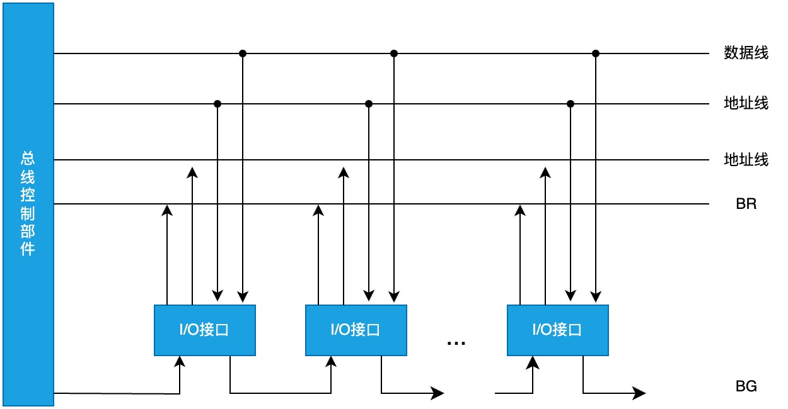

# 总线仲裁

## 集中仲裁方式

控制逻辑集中于 CPU 一处。

### 链式查询方式

特点: 只需要很少几根线就能按一定优先次序实现总线控制，容易扩充设备但对电路故障敏感，且优先级低的设备很难获得请求。

### 计数器定时查询方式

特点:计数可以从 0 开始，此时一旦设备的优先次序被固定，设备的优先级就按 0，1,2,.,.n 的顺序降序排列，而且固定不变；计数也可以从上一次计数的终止点开始，即是一种循环方法，此时设备使用总线的优先级相等；计数器的初始值还可由程序设置，故优先次序可以改变。优先级设置较灵活，对故障不敏感，但连线及控制过程较复杂。

### 独立请求方式

特点:响应速度快，优先次序控制灵活，但控制线数量多，总线控制更复杂。

三种方式所需控制线的条数分别为:

- 链式查询: 两条
- 计数器定时查询: 约 log2n 条
- 独立请求方式 2n 条

## 分布仲裁方式

控制逻辑分布在与总线连接的各个设备或部件上。
