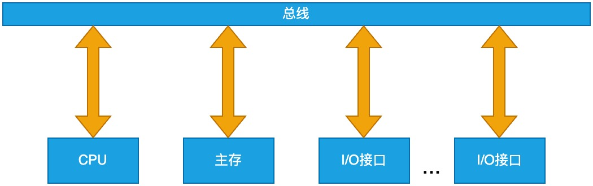
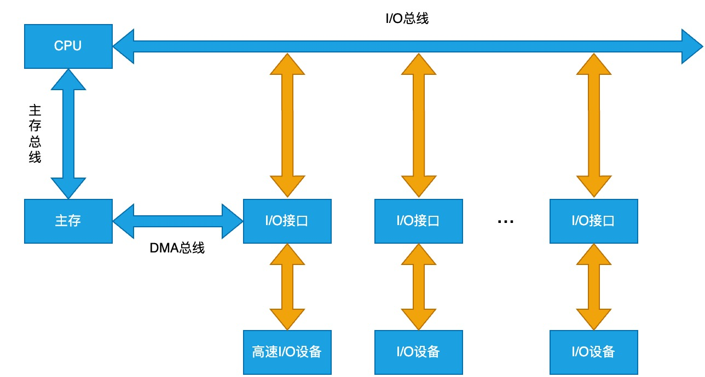

# 系统总线的结构

## 单总线结构

- 优点: 结构简单，成本低，设备接入简便
- 缺点: 多个设备征用唯一的总线，造成数据传输带宽低，且不支持并发

## 双总线结构

通道: 专门用于输入输出操作的简单处理器, 可以处理一些简单的指令。

- 优点: 将低速设备和高速设备挂在不同的总线上，高速设备挂在主存总线上，低速设备挂在 I/O 总线上，然后再通过通道与主存总线连接，使得低速设备对高速设备的数据传输影响缩小
- 缺点: 通道访问主存仍然需要占用主存总线，对高速设备还是有一定的影响，通道的引入使得硬件设计更为复杂

## 三总线结构

- 优点: DMA 总线的引入使得部分高速 I/O 设备可以直接访问主存，使得传输速率进一步提高
- 缺点: DMA 控制器的引入使得硬件设计更为复杂
