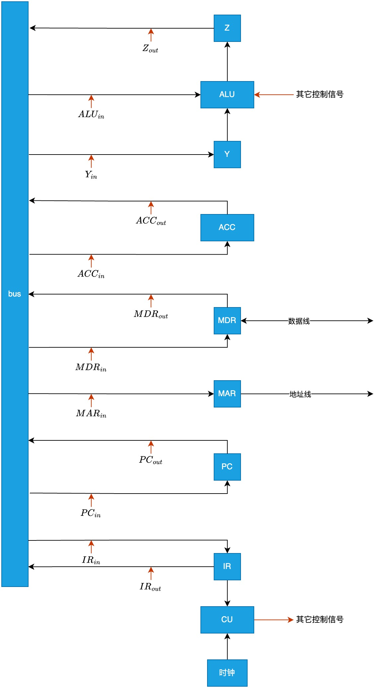
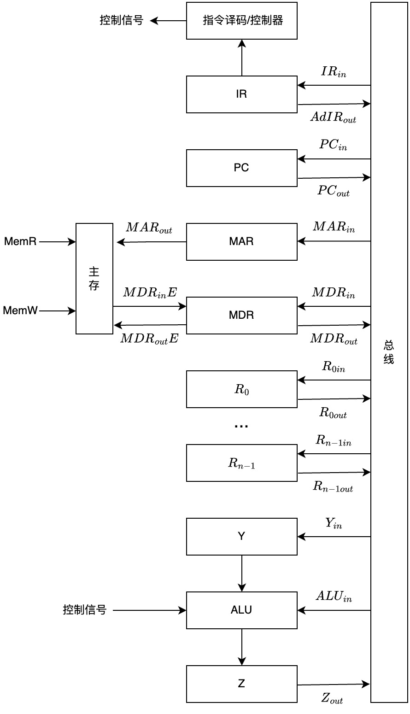
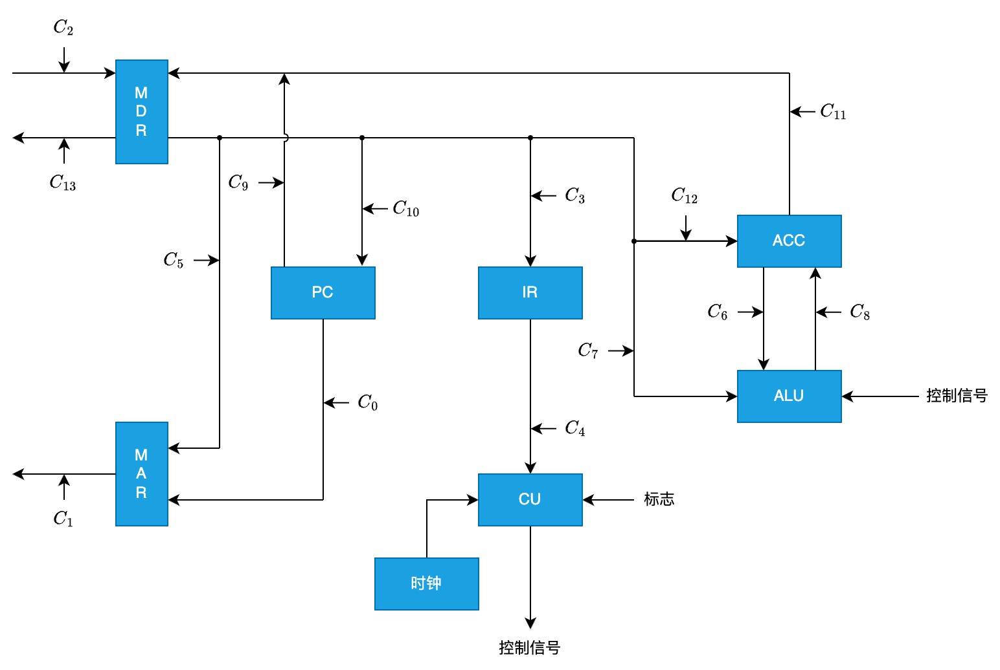
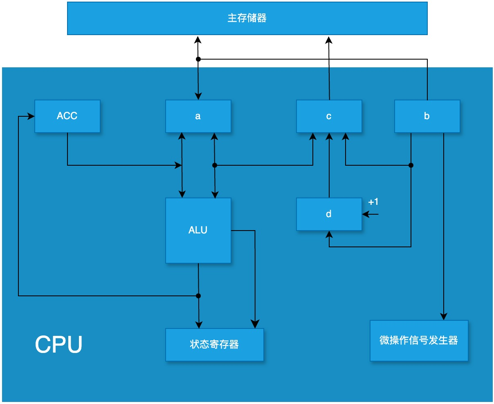

# 数据通路

## CPU 内部采用单总线方式的数据通路

- bus: CPU 内部的总线, 用来在 CPU 内部传输数据
- Y 和 Z 寄存器: 用于暂时存储参与运算的数据和中间结果
- 红线: CU 的控制信号
- 黑线: 数据



寄存器之间的数据传送, 以 PC 中的数据送入 MAR 为例:

1. PC 中的数据送入 MAR
   - PC<sub>out</sub> 和 MAR<sub>in</sub> 有效
   - (PC) -> bus -> MAR

主存与 CPU 的数据传送, 以 CPU 从主存中取指令为例:

1. PC 中的数据送入 MAR
   - PC<sub>out</sub> 和 MAR<sub>in</sub> 有效
   - (PC) -> bus -> MAR
2. CU 通过控制总线向主存发送读信号: 1 -> 控制总线 -> R
3. 把指令从主存送入 MDR:
   - MDR<sub>in</sub> 有效
   - M(MAR) -> 数据总线 -> MDR
4. 把指令从 MDR 送入 IR:
   - MDR<sub>out</sub> 和 IR<sub>in</sub> 有效
   - (MDR) -> bus -> IR

执行算术/逻辑运算, 以加法为例:

1. 将指令的地址码送入 MAR
   - IR<sub>out</sub> 和 MAR<sub>in</sub> 有效
   - Ad(IR) -> bus -> MAR
   - 注意: 取指后 MDR 中保存的也是指令, 所以也可以从 MDR 中把指令送到 MDR: (MDR) -> bus -> MAR
2. 向主存发送读命令, 启动主存执行读操作: 1 -> R
3. 把加法运算的操作数从主存送入 MDR
   - MDR<sub>in</sub> 有效
   - M(MAR) -> 数据总线 -> MDR
4. 把操作数送入 Y 中暂存:
   - Y<sub>in</sub> 和 MDR<sub>out</sub> 有效
   - (MDR) -> bus -> Y
5. ACC 中存放的是被加数, 把 ACC 和 Y 相加, 结果暂存到 Z 中:
   - ALU<sub>in</sub> 和 ACC<sub>out</sub> 有效
   - CU 向 ALU 发送加法命令
   - (ACC) + (Y) -> Z
6. 把 Z 中的结果放回 ACC:
   - ACC<sub>in</sub> 和 Z<sub>out</sub> 有效
   - (Z) -> bus -> ACC

由于单总线方式在同一时刻只能进行一次数据传输操作, 而 ALU 同时需要两个输入, 所以要先把一个操作数临时存放到寄存器 Y 中。如果采用多总线方式, 则可以通过另一条内部总线直接把数据送给 ALU。

### 例题

设有如图所示的单总线结构，分析指令 ADD (R0),R1 的指令流程和控制信号。



取指周期:

| 时序 | 微操作         | 有效控制信号                               |
| ---- | -------------- | ------------------------------------------ |
| 1    | (PC) -> MAR    | PC<sub>out</sub>, MAR<sub>in</sub>         |
| 2    | M(MAR) -> MDR  | MemR, MAR<sub>out</sub>, MDR<sub>in</sub>E |
| 3    | (MDR) -> IR    | MDR<sub>out</sub>, IR<sub>in</sub>         |
| 4    | 指令译码       | -                                          |
| 5    | (PC) + 1 -> PC | -                                          |

间址周期: 完成取数操作，被加数在主存中，加数已经放在寄存器 R<sub>1</sub> 中

| 时序 | 微操作                 | 有效控制信号                               |
| ---- | ---------------------- | ------------------------------------------ |
| 1    | (R<sub>0</sub>) -> MAR | R<sub>0out</sub>, MAR<sub>in</sub>         |
| 2    | M(MAR) -> MDR          | MemR, MAR<sub>out</sub>, MDR<sub>in</sub>E |
| 3    | (MDR) -> Y             | MDR<sub>out</sub>, Y<sub>in</sub>          |

执行周期:

| 时序 | 微操作                     | 有效控制信号                                                  |
| ---- | -------------------------- | ------------------------------------------------------------- |
| 1    | (R<sub>1</sub>) + (Y) -> Z | R<sub>1out</sub>, ALU<sub>in</sub>, CU 向 ALU 发 ADD 控制信号 |
| 2    | (Z) -> MDR                 | Z<sub>out</sub>, MDR<sub>in</sub>                             |
| 3    | (MDR) -> M(MAR)            | MemW, MDR<sub>out</sub>E, MAR<sub>out</sub>                   |

## CPU 内部采用专用数据通路方式

在任意两个需要通信的器件之间都建立专用的数据通路



取指周期:

1. (PC) -> MAR, C<sub>0</sub> 有效
2. (MAR) -> 主存, C<sub>1</sub> 有效
3. 1 -> R
4. M(MAR) -> MDR, C<sub>2</sub> 有效
5. (MDR) -> IR, C<sub>3</sub> 有效
6. (PC) + 1 -> PC
7. Op(IR) -> CU, C<sub>4</sub> 有效

### 例题



判断 a, b, c, d 分别是什么部件:

- a: MDR
- b: IR
- c: MAR
- d: PC

取指周期的数据通路:

1. (PC) -> MAR
2. M(MAR) -> MDR
3. (MDR) -> IR

描述运算器和主存之间进行存储访问的数据通路(执行周期取数据+运算+保存结果):

1. M(MAR) -> MDR
2. (MDR) -> ALU
3. ALU -> ACC

简述完成指令 LDA X 的数据通路(X 为主存地址, LDA 的功能是 (X) -> ACC):

1. (X) -> MAR
2. M(MAR) -> MDR
3. (MDR) -> ALU, 因为 MDR 和 ACC 之间没有通路, 所以需要 ALU 中转
4. ALU -> ACC

简述完成指令 ADD Y 的数据通路(Y 为主存地址, ADD 的功能是 (ACC) + (Y) -> ACC):

1. (Y) -> MAR
2. M(MAR) -> MDR
3. (MDR) -> ALU, (ACC) -> ALU
4. ALU -> ACC

简述完成指令 STA Z 的数据通路(Z 为主存地址, STA 的功能是 (ACC) -> Z):

1. (Z) -> MAR
2. (ACC) -> MDR
3. (MDR) -> M(MAR)

## 多级时序系统

计算机的多级时序系统是一种用于控制计算机内部各种操作的时间序列机制。它就像一个复杂的节拍器，通过不同层次的时间信号来协调计算机硬件各个部件(如 CPU、内存、I/O 设备等)的工作，确保数据的传输、指令的执行等操作能够有条不紊地按照特定的顺序和时间间隔进行。

时钟周期(Clock Cycle)是计算机系统或数字电路中最基本的时间单位，也称为节拍(Tick)或时钟脉冲周期(Clock Pulse Cycle)。它是由计算机的主时钟源(通常是一个晶体振荡器)产生的周期性信号的一个周期。这个主时钟信号就像一个节拍器，为系统内的所有操作提供了基本的时间节奏。

机器周期(Machine Cycle)是计算机操作的基本时间单位，它通常由多个时钟周期组成, 一般把访问一次存储器的时间作为机器周期。一个机器周期可以完成一个基本的操作，如从内存中读取一个指令字或完成一次数据传输。例如，在早期的 8086 微处理器中，一个机器周期用于完成一次内存读写操作，它包含了 4 个时钟周期，每个时钟周期执行不同的微操作。

指令周期(Instruction Cycle)是指计算机执行一条指令所需要的时间。一条指令的执行通常包括多个机器周期，以加法指令为例，首先需要从内存中取出加法指令(取指阶段，一个机器周期)，然后对指令进行译码以确定操作数的位置和操作类型(译码阶段，可能一个机器周期)，接着从内存或寄存器中获取操作数并进行加法运算(执行阶段，可能一个或多个机器周期)，最后将结果存储到指定的位置(存储结果阶段，一个机器周期)。

设某 CPU 的主频为 8MHz, 每个机器周期平均含有 2 个时钟周期, 每条指令的指令周期, 平均含有 2.5 个机器周期.

(1) 指令平均执行速度为多少 MIPS?

主频是 8MHz, 则时钟周期是 1 ÷ 8 = 0.125μs, 则机器周期为 2 × 0.125 = 0.25μs, 则指令周期为 2.5 × 0.25 = 0.625μs

所以平均指令执行速度为 1 ÷ 0.625 = 1.6MIPS

(2) 若主频不变, 每个机器周期变为平均含有 4 个时钟周期, 每条指令的指令周期平均含有 5 个机器周期, 则指令平均执行速度为多少 MIPS?

时钟周期是 0.125μs, 则指令周期为 5 × 4 × 0.25 = 2.5μs

所以平均指令执行速度为 1 ÷ 2.5 = 0.4MIPS

(3) 前两问说明了什么?

机器的运行速度不完全取决于主频

## 组合逻辑(硬布线)控制

组合逻辑(硬布线)控制通过使用组合逻辑电路(由逻辑门组成，如与门、或门、非门等的组合)来直接根据当前的指令和处理器状态产生控制信号，以控制 CPU 内各个部件(如寄存器、算术逻辑单元 ALU、数据通路等)的操作。

取指周期的节拍安排:

1. T0: (PC) -> MAR, 1 -> R
2. T1: M(MAR) -> MDR
3. T2: (MDR) -> IR, OP(IR) -> CU, (PC) + 1 -> PC

间指周期的节拍安排:

1. T0: Ad(IR) -> MAR, 1 -> R
2. T1: M(MAR) -> MDR
3. T2: (MDR) -> Ad(IR)

执行周期(加法, 假设 ACC 中已经保存了一个操作数)的节拍安排:

1. T0: Ad(IR) -> MAR, 1 -> R
2. T1: M(MAR) -> MDR
3. T2: (ACC) + (MDR) -> ACC

中断周期的节拍安排:

1. T0: a -> MAR, 1 -> W
2. T1: (PC) -> MDR
3. T2: MDR -> M(MAR), 向量地址 -> PC

## 微程序控制

微程序控制将 CPU 执行的每一条机器指令分解为一系列更基本的微操作，每个微操作由一条微指令来控制，而这些微指令的有序集合就构成了微程序。通过执行微程序来实现对 CPU 内各个部件的控制，完成机器指令的功能。

CPU 内部的相关部件:

- 控制存储器(Control Memory，简称 CM)是微程序控制计算机中的一个重要组成部分。它是一种只读存储器(Read - Only Memory，ROM)，用于存储微程序。微程序是由一系列微指令组成的，这些微指令的有序执行可以实现计算机的各种机器指令功能
- 微地址形成部件主要负责根据当前的机器指令、微指令执行状态、以及各种条件标志等来生成下一条微指令在控制存储器(CM)中的地址，这个地址被称为微地址。简单来说，它就像是一个导航器，指引着微程序的执行流程，决定了下一条要执行的微指令从控制存储器的何处取出
- 顺序逻辑: 根据输入的标志和时钟信号来控制微指令的执行顺序
- 控制存储器地址寄存器(Control Memory Address Register, CMAR)用于存放微指令在控制存储器(CM)中的地址
- 控制存储器数据寄存器(Control Memory Data Register, CMDR)用于暂存从控制存储器（CM）中读取出来的微指令数据

微指令基本格式:

```
[操作控制][顺序控制]
```
