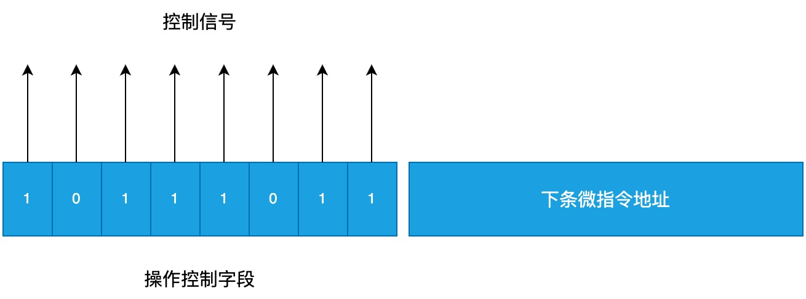
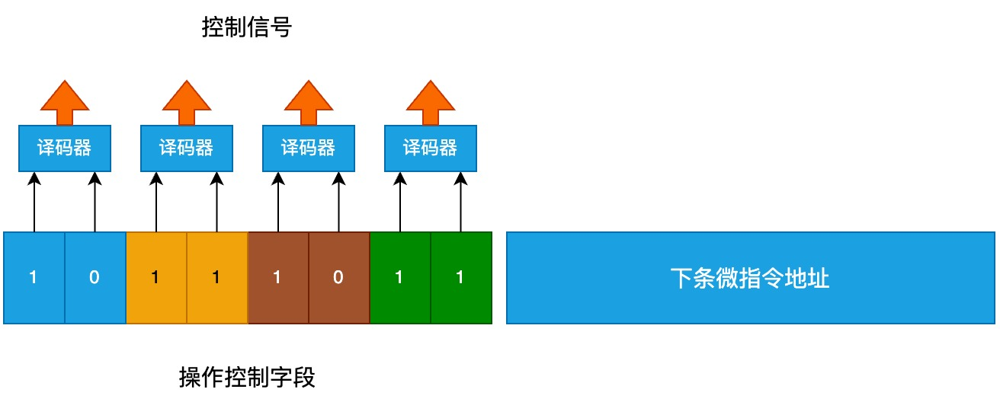
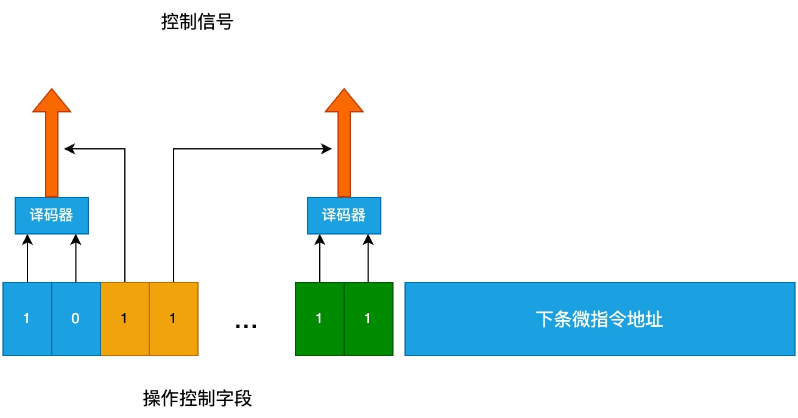

# 微程序控制

微程序控制将 CPU 执行的每一条机器指令分解为一系列更基本的微操作, 每个微操作由一条微指令来控制, 而这些微指令的有序集合就构成了微程序。通过执行微程序来实现对 CPU 内各个部件的控制, 完成机器指令的功能。

CPU 内部的相关部件:

- 控制存储器(Control Memory, 简称 CM)是微程序控制计算机中的一个重要组成部分。它是一种只读存储器(Read - Only Memory, ROM), 用于存储微程序。微程序是由一系列微指令组成的, 这些微指令的有序执行可以实现计算机的各种机器指令功能
- 微地址形成部件主要负责根据当前的机器指令、微指令执行状态、以及各种条件标志等来生成下一条微指令在控制存储器(CM)中的地址, 这个地址被称为微地址。简单来说, 它就像是一个导航器, 指引着微程序的执行流程, 决定了下一条要执行的微指令从控制存储器的何处取出
- 顺序逻辑: 根据输入的标志和时钟信号来控制微指令的执行顺序
- 控制存储器地址寄存器(Control Memory Address Register, CMAR)用于存放微指令在控制存储器(CM)中的地址
- 控制存储器数据寄存器(Control Memory Data Register, CMDR)用于暂存从控制存储器（CM）中读取出来的微指令数据

微指令基本格式:

```
[操作控制][顺序控制]
```

取指周期(假设取出 LDA 指令, LDA 指令用来读取内存中指定地址的数据):

1. 把微程序的首址(第一条微指令的地址)送入 CMAR: M -> CMAR
2. 取微指令: CM(CMAR) -> CMDR
3. 根据第一条微指令的操作码产生微操作命令, 第一条微指令的"操作控制"字段中值为 1 的位发出控制信号, 可以并行发出多个信号, 比如: (PC) -> MAR, 1 -> R
4. 形成下一条微指令的地址, 由本条微指令的"顺序控制"字段指出下一条微指令的地址, 并送到 CMAR: Ad(CMDR) -> CMAR
5. 取第二条微指令: CM(CMAR) -> CMDR
6. 根据第二条微指令的操作码产生微操作命令, 比如: M(MAR) -> MDR
7. 形成下一条微指令的地址: Ad(CMDR) -> CMAR
8. 以此类推, 直到执行完取指周期的最后一条微操作

执行周期(假设执行 LDA 指令):

1. 形成 LDA 微程序的首址, 当 LDA 指令存入 IR 后, LDA 指令的操作码会直接送到微地址形成部件, 该部件的输出就是 LDA 微程序的首址 P, 并将 P 送入 CMAR: OP(IR) -> 微地址形成部件 -> CMAR
2. 取微指令: CM(CMAR) -> CMDR
3. 产生微命令: Ad(IR) -> MAR, 1 -> R
4. 形成下一条微指令的地址: Ad(CMDR) -> CMAR
5. 取微指令: CM(CMAR) -> CMDR
6. 以此类推

## 微指令的编码方式

### 直接编码方式



上图有 8 种控制信号(操作控制字段有多少位, 就有多少种控制信号)。

### 字段直接编码方式



每两位连接到一个译码器, 经过译码之后发出控制信号。每个译码器可以有 4 种不同的输入, 去掉 00 后(00 表示不发出控制信号), 可以发出 3 种控制信号。最多能发出 12 种控制信号。

### 字段间接编码方式



部分字段用来译码, 把译码的结果和其余字段混合后得到控制信号。

### 混合编码方式

在同一个系统中, 混合使用上面的几种编码方式。

## 微指令序列地址的形成方式

- 把指令的操作码送入微地址形成部件产生
- 由硬件直接产生微程序的首址
- 由微指令的顺序控制字段直接给出
- 增量计数法: 由于多数情况下后续的指令地址是连续的, 所以可以直接把 CMAR 里的值加一, 即 (CMAR) + 1 -> CMAR
- 分支转移法: 根据各种标志决定微指令分支转移的地址
- 通过网格测试形成

## 微指令格式

- 水平型微指令: 直接编码、字段直接编码、字段间接编码和混合编码都属于水平型微指令，特点是一次能定义并执行多个并行操作的微指令
- 垂直型微指令: 操作码类似于机器指令，通常一条微指令有一两个微命令控制一两中操作，不强调并行功能
- 混合型微指令: 上面两种的混合

两种微指令格式的比较

- 水平微指令比垂直微指令并行操作能力强、效率高、灵活性强
- 水平微指执行一条机器指令所需要的微指令数目少，因此速度比垂直微指令速度快
- 水平微指用较短的微程序结构换取较长的微指令结构，垂直型微指令用较长的程序结构换取较短的微指令结构
- 水平微指与机器指令差别较大，垂直型微指令与机器指令类似
