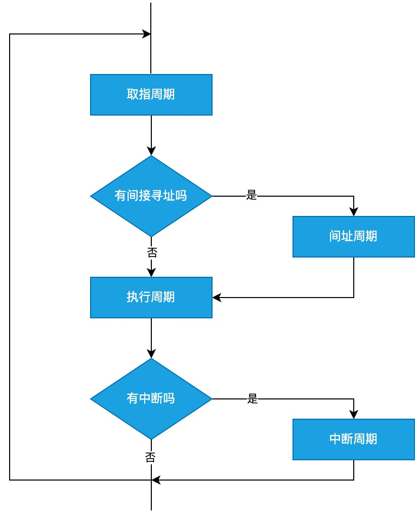
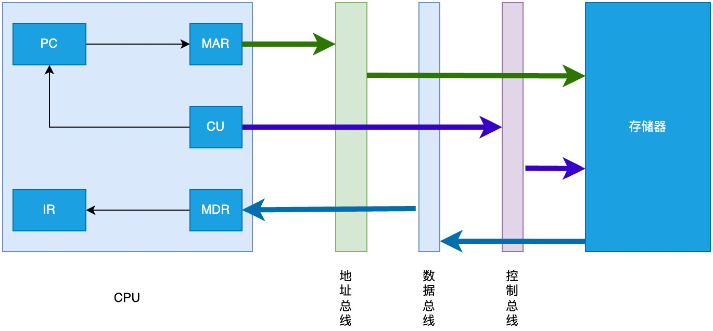
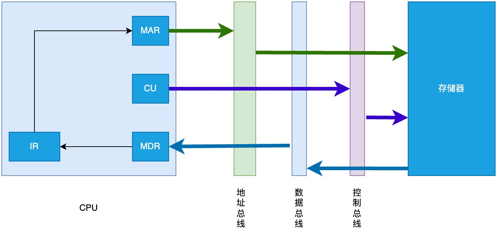
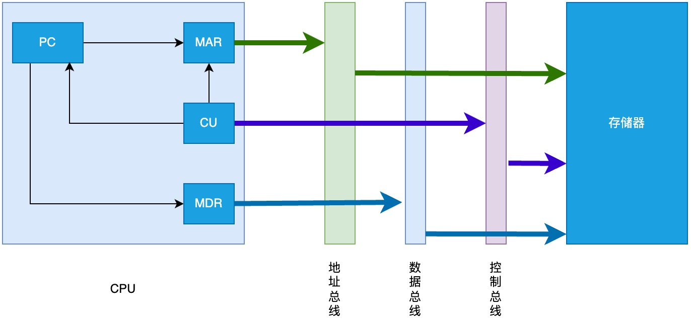

# 指令执行过程

## 取指周期的数据流

1. 当前指令的地址送到存储器地址寄存器: (PC) -> MAR
2. 向主存发送读命令, 启动主存执行读操作: 1 -> R
3. 将 MAR 所指向的主存单元中的内容通过数据总线送入 MDR: M(MAR) -> MDR
4. 将 MDR 中的指令送入 IR: (MDR) -> IR
5. CU 控制 PC 形成下一条指令的地址: (PC) + 1 -> PC

## 间指周期的数据流

1. 将指令的地址码送到存储器地址寄存器: Ad(IR) -> MAR
2. 向主存发送读命令, 启动主存执行读操作: 1 -> R
3. 将 MAR 所指向的主存单元中的内容通过数据总线送入 MDR: M(MAR) -> MDR
4. 将有效地址送至指令的地址码字段 MDR -> Ad(IR)

## 执行周期的数据流

不同指令的执行周期操作不同, 数据流多种多样, 因此没有统一的表示。

## 中断周期的数据流

中断(Interrupt)是计算机系统中的一种机制，它允许硬件或软件在发生特定事件时通知处理器暂停当前正在执行的程序，并转向执行一段专门用于处理该事件的代码。处理完之后，通常会返回到被中断的位置继续执行原来的程序。

向量地址(Vector Address)通常指的是在计算机系统中，特别是对于中断处理和异常处理机制而言，用于指向一段特定代码的位置，这段代码被称为中断服务程序(Interrupt Service Routine, ISR)或异常处理程序。当一个中断或异常发生时，处理器会根据相应的向量地址跳转到对应的 ISR 或异常处理程序开始执行。

1. 将特定地址 a 送入 MAR(假设把程序断点保存到主存的地址 a 处): a -> MAR
2. 向主存发送写命令, 启动主存执行写操作: 1 -> W
3. 将程序断点(此时 PC 的内容)送入 MDR: (PC) -> MDR
4. 将 MDR 的内容通过数据总线写入 MAR 指示的主存单元内: MDR -> M(MAR)
5. 将向量地址送入 PC, 为中断服务程序的取值周期做准备: 向量地址 -> PC

如果程序断点保存到栈中, 且栈向低地址方向扩展, 则需要将第 1 步改为: (SP) - 1 -> SP, SP -> MAR。
