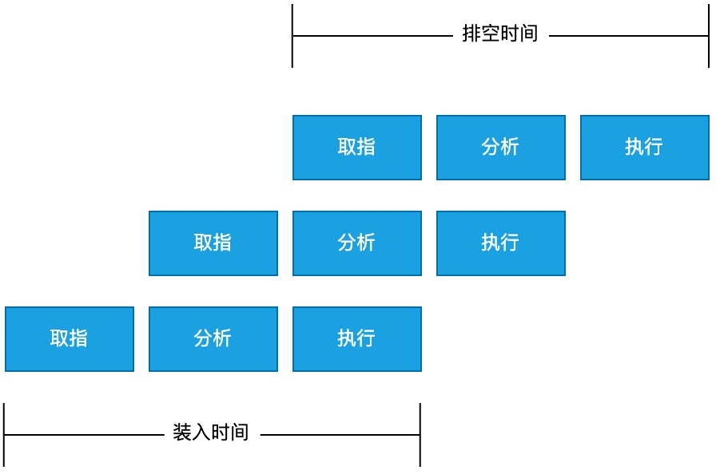

# 指令流水线

某一类指令可以分解成相似的阶段(取指, 分析, 执行), 并且每个阶段都可以由不同的部件独立完成。所以下一条指令不需要等到上一条指令完全执行完之后再开始执行(在第一条指令的分析阶段, 就可以开始第二条指令的取指了)。

比如第一条指令取指完成后, 就会把结果保存在锁存器中, 供分析阶段使用。如果没有锁存器, 第二条指令执行时, 取指部件会取新的数据, 把第一条指令的数据覆盖掉。

## 流水线方式的特点

- 把一个任务(一条指令或者操作)分解成几个不同的子任务，每个子任务有专门的部件来完成，靠多个部件可并行工作来缩短指令执行的时间
- 每个部件后边都有一个缓冲寄存器，叫锁存器，其作用是保存本流水段的结果，给下一流水段用
- 流水线中各子任务的完成耗时要基本相同，否则将引起堵塞和断流
- 只有连续不断的执行同一或者类似任务时流水线才能有较好的效率
- 流水线有装入时间和排空时间。装入时间是第一个任务进入流水线到输出流水线的时间；排空时间是最后一个任务进入流水线到输出流水线的时间

## 影响流水线执行效率的因素
