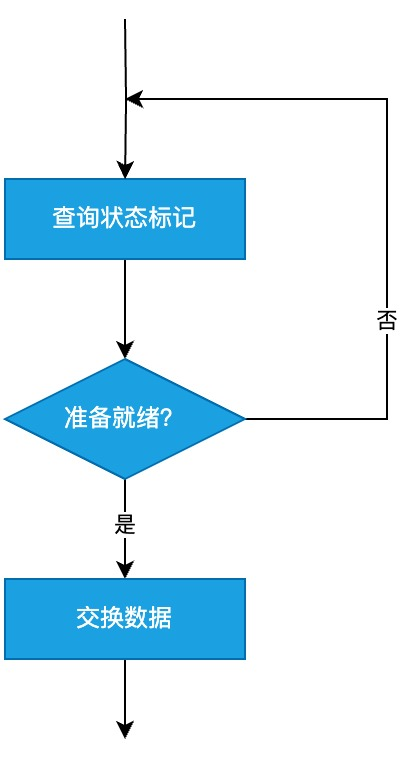
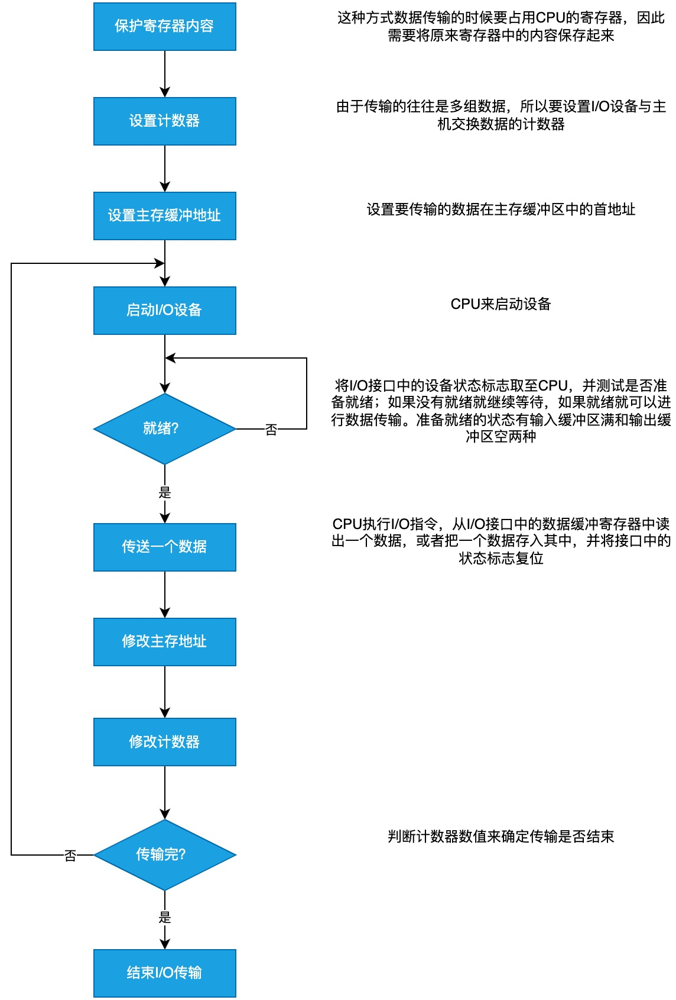

# 主机与 I/O 设备通讯的方式

## 程序查询方式

大体流程:

程序查询方式的特点是每时每刻不断查询 I/O 设备是否准备就绪。

详细流程:

## 程序中断方式

中断: 计算机在程序执行过程中，当出现异常或者特殊情况时，计算机停止现行程序的执行转向对这些异常情况或特殊情况的处理，处理结束后再返回现行程序的间断处，继续执行原程序。

### 中断请求

中断请求是指中断源向 CPU 发送中断请求信号, 分类:

- 内中断和外中断:
  - 内中断: 来自 CPU 和内存的中断，如除数为 0 等程序运算产生的错误或者内存不足、空间分配失败产生的中断
  - 外中断: 来自 CPU 和内存以外的部件产生的中断，如 I/O 设备的中断
- 硬中断和软中断:
  - 硬中断: 通过外部硬件产生的中断。硬中断属于外中断
  - 软中断: 通过指令产生的中断，可编程实现。软中断属于内中断
- 非屏蔽中断和可屏蔽中断
  - 都属于外中断

### 中断判优

中断系统在某一时刻只能响应一个中断源的请求，但不同中断源发出请求是随机的，因此可能某一时刻会同时产生多个中断请求，这时候要按照某种规则来选择一个中断请求进行响应。

一般硬件故障属于最高级中断，其次是软件中断，非屏蔽中断高于可屏蔽中断，DMA 请求高于 I/O 设备，高速设备高于低速设备，输入设备高于输出设备，实时设备高于普通设备。

### 中断响应和处理

响应条件: 必须满足 CPU 中的允许中断触发器 EINT 为“1”。该触发器可以用开中断指令打开，可以用关中断指令或者由硬件自动关闭。

响应时间: CPU 响应中断的时间是在每条指令执行阶段的结束时刻。

中断处理:

1. 保护现场
2. 中断服务
3. 恢复现场
4. 中断返回

## 多重中断

CPU 具备多重中断功能的条件:

1. 在中断服务程序中提前设置开中断指令
2. 优先级别高的中断有权中断优先级别低的中断

屏蔽字: 每个中断源都有一个屏蔽触发器，1 表示屏蔽该中断源的中断请求，0 表示接受该中断源的中断请求；所有屏蔽触发器组合在一起构成一个屏蔽字寄存器，屏蔽字寄存器的内容称之为屏蔽字。

## DMA 方式

数据传输过程

输入:

1. 当设备准备好一个字时, 先发出选通信号, 将该字读到 DMA 的数据缓冲寄存器(BR)中, 表示数据缓冲寄存器"满"
2. 与此同时, 设备向 DMA 接口发请求(DREQ)
3. DMA 接口向 CPU 申请总线控制权(HRQ)
4. 如果 CPU 同意, 会发回 HLDA 信号, 表示允许将总线控制权交给 DMA 接口
5. 将 DMA 主存地址寄存器中的主存地址送到地址总线, 并命令主存写
6. 通知设备已被授予一个 DMA 周期(DACK), 并为交换下一个字做准备
7. 将 DMA 数据寄存器中的内容送到数据总线
8. 主存将数据总线上的数据写到地址总线指定的存储单元中
9. 修改主存地址和字计数器值
10. 断数据块是否传送结束，若未结束，则继续传送；若已结束，则向 CPU 申请程序中断，标志数据块传输结束

输出:
