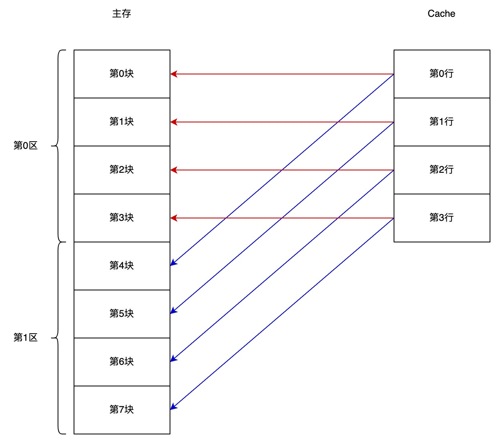
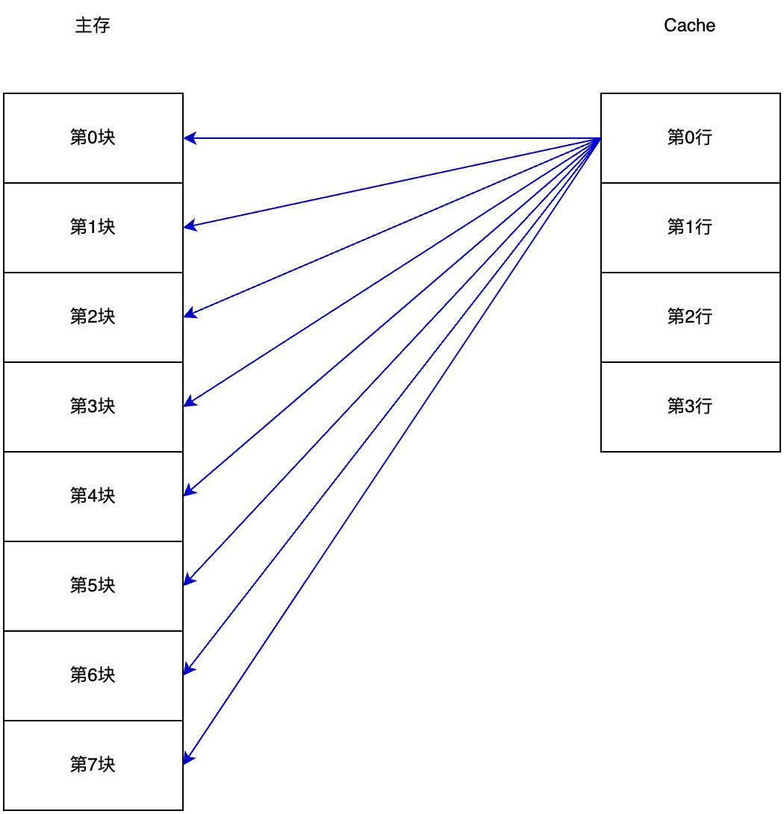

# Cache

Cache(缓存)是一种用于提高数据访问速度的技术。它通常存储的是最近或最频繁使用的数据副本, 以便于快速访问这些数据。当系统再次请求相同的数据时, 它可以先检查缓存中是否存在该数据的副本, 如果存在(这称为命中), 则可以直接从缓存中读取数据, 而不是重新计算或从原始位置加载, 这样可以大大减少延迟并提高性能。

## 程序的局部性访问原理

- 时间局部性: 现在正在用的数据, 很可能在不久的将来还会用到
- 空间局部性: 现在正在用的数据, 很可能和在不久的将来要用到的数据在空间上相邻

## 主存到 cache 的地址映射

cache 和主存之间的数据交换是以 字块 为单位的(一个块由多个字组成), 在 cache 中块又叫做缓存行。cache 和 CPU 之间的数据交换是以字为单位的(因为寄存器每次只能读写一个字)。

从地址的角度理解分块:

1. n 位地址分成两块: 块地址是 1 位, 块内地址是 n - 1 位 0XXXXX... 和 1XXXXX...
2. n 位地址分成四块: 块地址是 2 位, 块内地址是 n - 2 位 00XXXX..., 01XXXX..., 10XXXX... 和 11XXXX...
3. n 位地址分成 2<sup>m</sup> 块: 块地址是 m 位, 块内地址是 n - m 位, 每个块的大小是 2<sup>n - m</sup> 个字

### 直接映射

在直接映射中, 主存的每若干块组成了一个区, 每个区包含的块数取决于 Cache 中的行数。Cache 中有多少行, 主存的一个区就由多少块组成。

假设主存有 8 个块, cache 有 4 个行。主存每个区的第 0 块只能映射到 Cache 中的第 0 行, 每个区的第 3 块只能映射到 Cache 中的第 3 行。即, 主存中每个区的第 i 块会映射到 Cache 中的第 i 行。



在这种映射方式中, 主存地址由三部分组成:

- 主存字块标记: 由于主存的块数是 cache 的好几倍, 所以 cache 的每个块可以映射到主存的多个块。这就需要用额外的标记来区分映射过来的是第 0 块还是第 4 块。主存和 cache 中都会加上这个标记, 根据主存字块标记和 cache 上的标记是否相同来判断映射的是哪块
- Cache 字块地址: 用来查找 cache 中的某一块。比如 cache 分成了 4 块, 需要 2<sup>2</sup> 个地址对应, 字块地址的长度就是 2 位
- 字块内地址: 块内地址在 Cache 和主存中相同

主存块对应的 cache 块号: `主存的块号 % cache的块数` 假设 cache 的容量是 4 个块, 那么主存中块号 6 映射到 cache 中就是 `6 % 4` = 2 号块。

cache 的标记位长度: `主存地址位数 - cache地址位数`。

#### 例题

主存容量为 512KB, cache 的容量是 4KB, 每个块 16 个字, 每个字 32 位(按字节寻址)。

(1) cache 的地址有多少位, 有多少块

cache 容量为 4KB = 2<sup>12</sup>B, 所以地址是 12 位。

每个块 16 个字, 每个字 32 位(4 个字节), 所以每个块 64 个字节, cache 有 2<sup>12</sup>B ÷ 64B = 2<sup>6</sup> 个块。

(2) 主存的地址有多少位, 有多少块

主存容量为 512KB = 2<sup>19</sup>B, 所以地址是 19 位。

每个块 64 个字节, 主存有 2<sup>19</sup>B ÷ 64B = 2<sup>13</sup> 个块。

(3) 采用直接映射方式, 则主存的第几块会映射到 cache 的第 7 块(起始块设为第 1 块)

主存的第 7 块会映射到 cache 的第 7 块。

主存的第 7 块会映射到 cache 的第 7 块。

主存的第 7 + 2<sup>6</sup> 块也会映射到 cache 的第 7 块。

主存的第 7 + 2<sup>6</sup> + 2<sup>6</sup> = 7 + 2 × 2<sup>6</sup> 块也会映射到 cache 的第 7 块。

主存的第 7 + 3 × 2<sup>6</sup> 块也会映射到 cache 的第 7 块。

...

以 2<sup>6</sup> 为步长在主存上寻找, 最大会移动 2<sup>13</sup> ÷ 2<sup>6</sup> = 2<sup>7</sup> 次。所以主存的第 7 + 2<sup>7</sup> × 2<sup>6</sup> 块也会映射到 cache 的第 7 块, 但是 7 + 2<sup>7</sup> × 2<sup>6</sup> 已经超出了主存的地址范围, 所以退回一步, 第 7 + (2<sup>7</sup> - 1) × 2<sup>6</sup> 块是最后一个映射到 cache 的第 7 块上的主存块。

(4) 画出当前主存地址的各段位数

- cache 有 2<sup>12</sup>B ÷ 64B = 2<sup>6</sup> 个块, 所以 cache 块地址: 6 位
- cache 地址是 12 位, 所以块内地址: 12 - 6 = 6 位
- 主存字块标记: 19 - 12 = 7 位

```
[主存字块标记: 7位][cache块地址: 6位][块内地址: 6位]
```

### 全相联映射

cache 中的每一个块都可能被主存的任意一个块映射。cache 中需要更长的标记位来指出对应主存中的哪个块。



假设主存的容量是 8 个块, 则主存的块地址是 3 位, 那么 cache 的标记位就是 3 位。

全相联映射没有 Cache 字块地址。

### 组相联映射

把 cache 中的块分组, 以组为单位和主存之间采用直接映射, 但是主存块具体映射到 cache 组内的哪个块, 则采用全相联映射。

假设 cache 的容量是 8 个块, 把它们两个块为一组, 一共有四组。则内存中第 1 块映射到 cache 第 1 组中的任意一个块, 内存中第 2 块映射到 cache 第 2 组中的任意一个块, ... , 内存中第 5 块映射到 cache 第 1 组中的任意一个块, ...


Cache 字块地址: 改为用来查找 cache 中的某一组。比如 cache 分成了 4 块, 两组, 需要 2<sup>1</sup> 个地址对应所有组, 字块地址的长度就是 1 位。

cache 的标记位长度: cache 每一组内有 2<sup>r</sup> 块, cache 和主存地址相差 t 位, 则标记位的长度是 t+r 位。

## 命中率

- 命中率 = cache 命中次数 ÷ (cache 命中次数 + 主存命中次数)
- 平均访问时间 = cache 的存取周期 × cache 命中率 + 主存的存取周期 × (1 - cache 命中率)
- 效率 = cache 的存取周期 ÷ 平均访问时间

### 例题

运行某程序时, 共访问 cache 命中 1000 次, 直接访问主存 100 次, cache 的存取周期位 50ns, 主存的存取周期为 300ns, 求命中率、效率和平均访问时间。

命中率: 1000 ÷ (1000 + 100) = 91%。

平均访问时间: 50 × 91% + 300 × (1 - 91%) = 72.5ns。

效率: 50ns ÷ 72.5ns = 69%。

## cache 字块替换算法

cache 满时需要把哪个块换出 cache。

直接映射中 cache 块和主存块的对应关系固定, 不需要替换算法。而在全相联和组相联中, 某一个主存块可能映射到 cache 的随机块中, 所以需要替换算法。

- 先进先出算法(FIFO): 把最先换入 cache 中的主存块换出
- 近期最少使用算法(LRU): 给每个 cache 块设置一个计数器, 每次访问 cache 把所有块的计数器加一, 当 cache 命中时把命中的块计数器清零, 把计数器值最大的块换出
- 最不经常使用算法(LFU): 给每个 cache 块设置一个计数器, 当 cache 命中时把命中的块计数器加一, 把计数器值最小的块换出
- 随机算法(RAND): 随机换出

对于组相联映射, 是以每个组为单位设置计数器并比较的。

## cache 的写策略

对于写操作, 如何保持 cache 和主存的数据同步。

### 全写法

cache 命中时, 把数据写入 cache 中相应的块的同时, 也写入到其在主存中对应的块。

cache 未命中时, 先把数据写入主存, 如果写入主存的数据不需要换入 cache, 则结束操作。如果需要换入 cache, 直接覆盖 cache 中对应的块即可。

### 写回法

cache 命中时, 先把数据写入 cache, 仅当被修改的 cache 块需要换出时才写回其在主存中对应的块。

cache 未命中时, 需要从主存中找出包含此数据的块。CPU 不会在主存中直接修改, 而是找到之后直接复制到 cache 中进行修改, 等从 cache 中换出这个块时, 再复制到主存。
