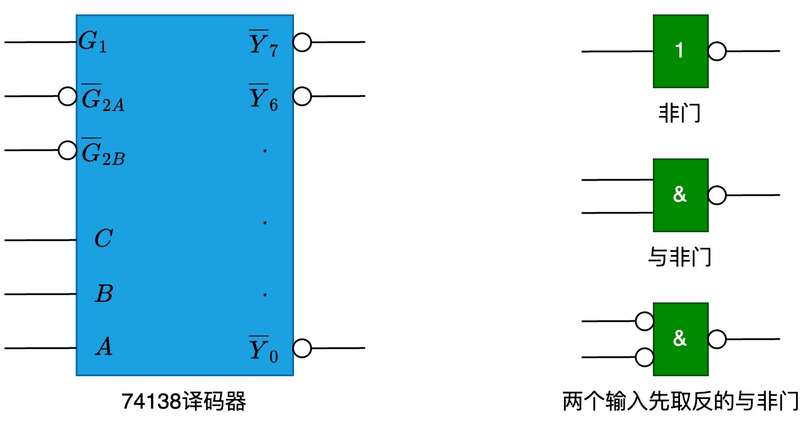

# 存储芯片和 CPU 连接

有一块 CPU, 地址线 16 根, 数据线 8 根, 用 MREQ 作为访存控制信号(低电平有效), WR 作为读/写控制信号(低电平为读, 高电平为写)。还有一些存储芯片:

1. RAM, 分别有 1K × 4 位、4K × 8 位、8K × 8 位三种
1. ROM, 分别有 2K × 8 位、4K × 8 位、8K × 8 位三种

还有一块 74138 译码器和一些门电路:

地址分配:

- 系统区(要使用 ROM): 6000H 到 67FFH
- 用户区(要使用 RAM): 6800H 到 6BFFH

## 分析

先把地址转成二进制:

- 系统区: 0110 0000 0000 0000 到 0110 0111 1111 1111。相减得到 0111 1111 1111 = 211, 即需要 11 根地址线, 所以使用 2K × 8 位的芯片
- 用户区: 0110 0000 1000 0000 到 0110 1011 1111 1111。相减得到 0011 1111 1111 = 210, 即需要 10 根地址线, 所以使用 1K × 4 位的芯片。题目的数据线是 8 根, 所以要两片为一组
