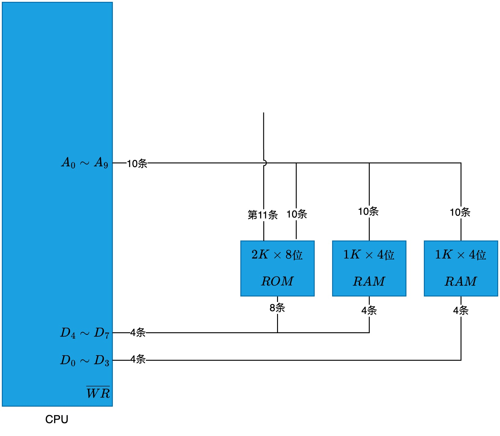
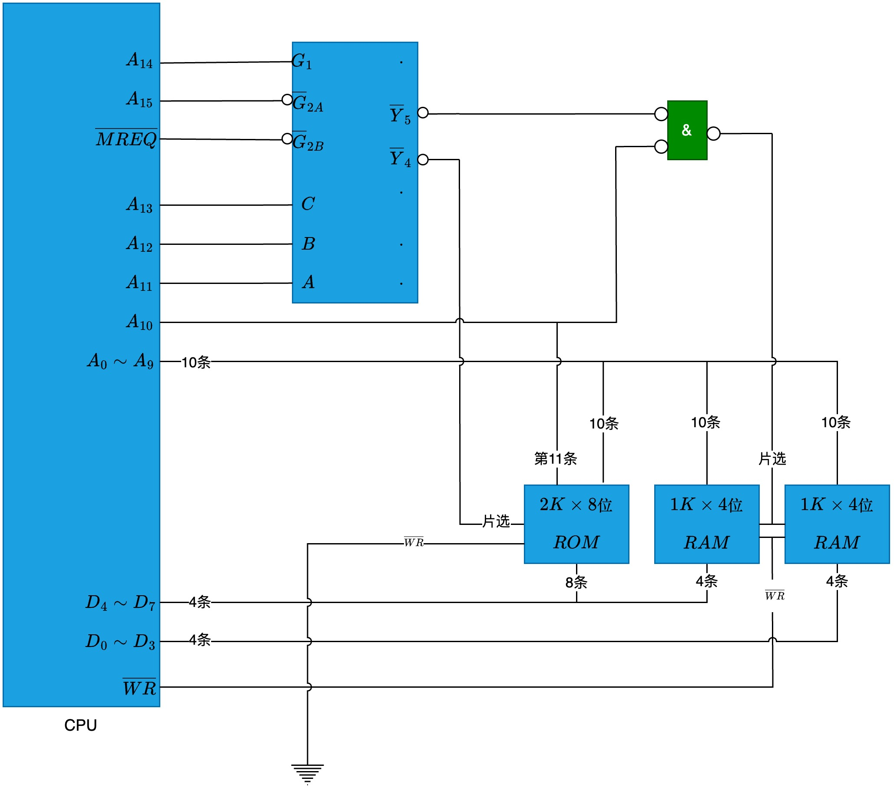

# 存储芯片和 CPU 连接

有一块 CPU, 地址线 16 条, 数据线 8 条, 用 MREQ 作为访存控制信号(低电平有效), WR 作为读/写控制信号(低电平为读, 高电平为写)。还有一些存储芯片:

1. RAM, 分别有 1K × 4 位、4K × 8 位、8K × 8 位三种
1. ROM, 分别有 2K × 8 位、4K × 8 位、8K × 8 位三种

还有一块 74138 译码器和一些门电路:

地址分配:

- 系统区(要使用 ROM): 6000H 到 67FFH
- 用户区(要使用 RAM): 6800H 到 6BFFH

## 分析

先把地址转成二进制:

- 系统区: 0110 0000 0000 0000 到 0110 0111 1111 1111。相减得到 0111 1111 1111 = 211, 即需要 11 条地址线, 所以使用 2K × 8 位的芯片
- 用户区: 0110 0000 1000 0000 到 0110 1011 1111 1111。相减得到 0011 1111 1111 = 210, 即需要 10 条地址线, 所以使用 1K × 4 位的芯片。题目的数据线是 8 条, 所以要两片为一组

连线

- 因为用到了两片 1K × 4 位的芯片, 所以 CPU 的数据线要分成两部分: D0 ~ D3 和 D4 ~ D7
- 因为小容量芯片(1K × 4)有 10 条地址线, 而系统区和用户区的地址范围低 10 位也是一样的(都是 00 0000 0000 到 11 1111 1111), 所以 CPU 的低 10 位地址线 A0 ~ A9 和所有芯片(ROM 和 RAM)的连接都是一样的

- 74138 译码器有三个输入(C, B, A), 可以译码 3 条地址线, 从高地址开始寻找能区分的系统区和用户区的 3 条地址线：
  - 第 15 位到 13 位的地址范围都是从 011 到 011, 无法区分
  - 第 14 位到 12 位的地址范围都是从 110 到 110, 无法区分
  - 第 13 位到 11 位的地址范围, 系统区是从 100 到 100, 用户区是从 101 到 101, 可以区分。所以把 A11、A12、A13 分别连到 A、B、C
- 74138 译码器输入 100 时 Y4 有效, 对应系统区, 输入 101 时 Y5 有效, 对应用户区。所以把 Y4 连到 ROM 的片选, Y5 连到 RAM 的片选
- CPU 第 11 位地址线(A10)只影响系统区, 用户区恒为 0, 所以把 A10 和 ROM 的第 11 条地址线相连
- Y5 连到 RAM 的片选后, 如果地址是 0110 1111 1111 1111(注意 A10 是 1) 也会访问到到用户区, 但实际上它的地址不属于用户区。所以只有满足 Y5 有效, 且 A10 为 0 两个条件时, 才能访问用户区, 使用两个输入先取反的与非门实现这个判断
- 不论系统区还是用户区, A15 固定是 0, 访存控制信号(MREQ)也是低电平有效, 所以把它们随便连到同样是低电平有效的 G2A 和 G2B 上
- A14 固定是 1, 所以把它连到同样是高电平有效的 G1 上
- 读写控制信号(WR)连到 RAM 上。ROM 一直可读, 所以 WR 接地
