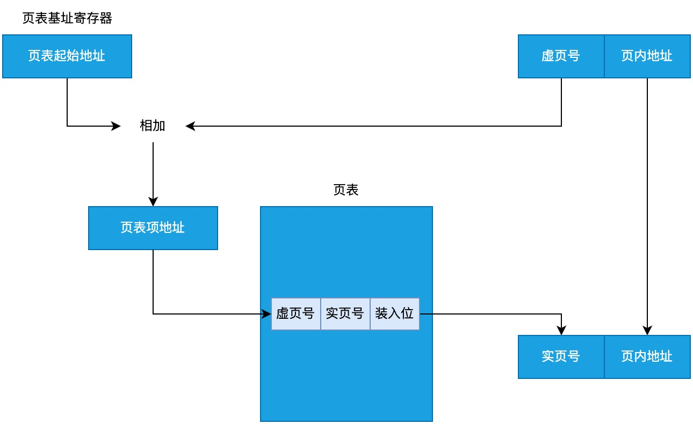
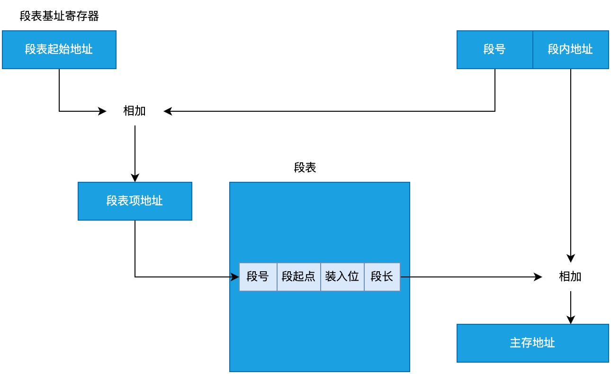

# 虚拟存储器

使用辅存为主存扩容。

虚地址(逻辑地址): 主存+辅存一起组成的逻辑上的地址。每个进程都有自己的虚拟地址空间, 这意味着每个进程都认为自己拥有整个地址空间。

实地址(物理地址): 内存中的实际物理位置。

## 页式虚拟存储器

把主存和辅存划分成一个个小的存储块, 这些存储块称为页, 每个页的大小相等。使用页表存储虚地址到实地址的映射。

页表的结构

| 虚页号 | 实页号 | 装入位 |
| ------ | ------ | ------ |
| 1      | 0000H  | 1      |
| 2      | -      | 0      |
| 3      | 1400H  | 1      |



- 虚地址和实地址的页内地址长度相等(因为页大小相等)
- 虚页号的长度大于实页号(因为虚地址更大)
- 使用页表基址寄存器存储页表在内存中的起始地址
- 把页表起始地址和虚页号相加, 得到页表项地址(就是虚页号所对应的项在页表中的位置)
- 访问页表项地址, 取出实页号, 就能找到实地址了
- 页表项中的装入位如果是 1, 表示实地址所对应的页已经被装入内存; 如果是 0, 表示对应的页还在辅存中, 需要先把它装入

## 段式虚拟存储器

把主存和辅存按照程序的逻辑划分成一个个的段, 每个段的大小和对应的程序有关。使用段表存储虚地址到实地址的映射。

段表的结构

| 段号 | 段起点 | 装入位 | 段长 |
| ---- | ------ | ------ | ---- |
| 1    | 0000H  | 1      | 1K   |
| 2    | -      | 0      | -    |
| 3    | 1400H  | 1      | 3K   |



- 段起点对应内存中实际的起始地址, 根据段长找到结束地址
- 把段起点和段内地址相加得到实地址

## 页式虚拟存储器和段式虚拟存储器的对比

特性功能对比:

- 页式虚拟存储器
  - 优点: 页表实现简单, 查表速度快
  - 缺点: 分页无逻辑意义, 不便于存储保护和多道程序共享
- 段式虚拟存储器
  - 优点: 段的界限分明, 分段有逻辑意义, 支持程序的模块化设计, 便于存储保护和多道程序共享
  - 缺点: 段表实现复杂, 查表速度慢

主存利用率对比

- 页式虚拟存储器: 主存利用率高, 最多有一些页没被数据填满
- 段式虚拟存储器: 主存利用率低, 会造成大量的段间内存浪费

## 段页式虚拟存储器

把程序按逻辑分段, 每个段内再分页, 主存也分成大小相等的页。程序调入主存时以页为单位。

虚地址构成

```sh
[段号][段内页号][页内地址]
```
