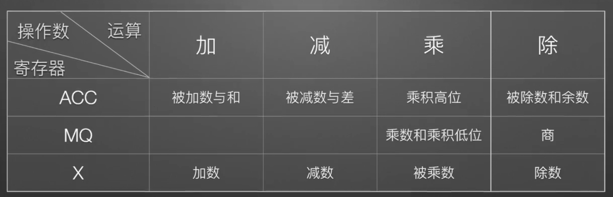

# 计算机的层次结构

存储基元: 存储一位二进制信息的物理元件，是存储器中最小的存储单位，又叫存储元件或存储元，不能单独存取。

存储单元：是计算机存储数据的基本单位, 可存放一个机器字并具有特定的存储地址。

计算机的结构:

- 主机
  - CPU
    - 运算器
      - MQ: 乘商寄存器(multiplier-quotient register)
      - ACC: 累加器(accumulator)
      - ALU: 算术逻辑单元(Arithmetic logic unit)
      - X: 操作数寄存器
    - 控制器
      - CU: 控制单元(Control Unit): 分析指令并发出各种控制信号来协调各部件完成指令所描述的操作
      - IR: 指令寄存器(Instruction register): 存放当前要执行的指令, 其内容来自 MDR
      - PC: 程序计数器(Program Counter): 存放当前要执行的指令的地址, 与 MAR 直接连通, 并且能自动加一
  - 主存
    - M: 存储体
    - MAR: 存储器地址寄存器(memory address register), 用来存放要操作的存储单元的地址。存储器的工作方式是按存储单元的地址存取
    - MDR: 存储器数据寄存器(memory data register), 用来存放从存储单元中取出或者将要存入存储单元的数据。MDR 的长度等于存储单元的长度, 称为存储字长, 即存储单元中存储基元的个数。存储字长可以因不同的机器而不同, 每 8 个存储基元称为一个字节, 存储字长是字节的整数倍
- I/O 设备

运算器中三个寄存器存储的数据:



指令的格式:

```
[ 操作码 | 地址码 ]
```

## 运算器的工作过程

M 表示主存中某个地址上的存储单元, `(M)` 表示取 M 中的数据。

加法:

1. (M) -> X
2. (ACC) + (X) -> ACC

乘法:

1. (M) -> MQ
2. (ACC) -> X
3. 0 -> ACC
4. (X) \* (MQ) -> ACC//MQ ACC 中存结果的高位, MQ 中存结果的低位, 把它们拼接起来

除法:

1. (M) -> X
2. (ACC) / (X) -> MQ 商
3. (ACC) % (X) -> ACC 余数

## 控制器的工作过程

IR 表示指令寄存器, `(IR)` 表示取指令寄存器中的数据, `OP(IR)` 表示取指令寄存器中的操作码, `Ad(IR)` 表示取指令寄存器中的地址码。

加法操作的完整过程:

1. (PC) -> MAR
2. (MDR) -> IR
3. OP(IR) -> CU
4. Ad(IR) -> MAR
5. (MDR) -> X
6. (ACC) + (X) -> ACC
7. (PC) + 1 -> PC
