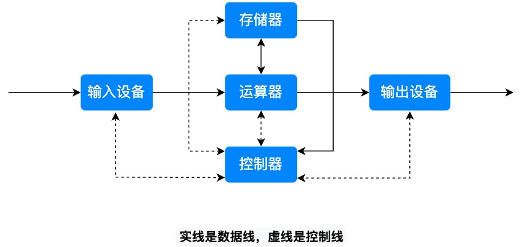
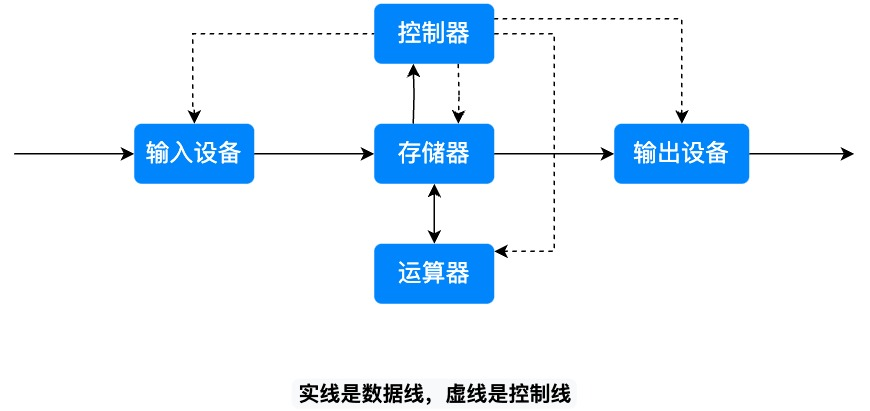
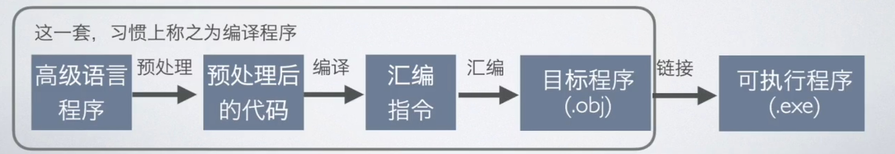

# 计算机的层次结构

存储基元: 又叫存储元件或存储元, 存储一位二进制数据(0 或 1)的物理元件, 是存储器中最小的存储单位, 不能单独存取。

存储单元: 是计算机存取数据的基本单位, 一个存储单元由多个存储元件组成。一个存储单元的长度(包含的存储元件个数)称为存储字长。存储字长可以因不同的机器而不同, 每 8 个存储基元称为一个字节, 存储字长是字节的整数倍。

## 字

字 是计算机处理数据的基本单位, 它的大小取决于具体的计算机体系结构。不同类型的计算机可能有不同的字长, 常见的字长有 16 位、32 位和 64 位等。一个字通常包含多个字节, 具体数量取决于字长。例如：

- 16 位计算机的字长为 2 字节
- 32 位计算机的字长为 4 字节
- 64 位计算机的字长为 8 字节

## 计算机的结构

- 主机
  - CPU
    - 运算器
      - MQ: 乘商寄存器(multiplier-quotient register)
      - ACC: 累加器(accumulator)
      - ALU: 算术逻辑单元(Arithmetic logic unit)
      - X: 操作数寄存器
      - PSW: 标志寄存器, 存放ALU运算得到的标志信息, 比如结果是否溢出、有无进位等
    - 控制器
      - CU: 控制单元(Control Unit): 分析指令并发出各种控制信号来协调各部件完成指令所描述的操作
      - IR: 指令寄存器(Instruction register): 存放当前要执行的指令, 其内容来自 MDR
      - PC: 程序计数器(Program Counter): 存放当前要执行的指令的地址, 与 MAR 直接连通, 并且能自动加一
  - 主存
    - M: 存储体, 由多个存储单元组成
    - MAR: 存储器地址寄存器(memory address register), 用来存放要操作的存储单元的地址。MAR 的位数反映最多可寻址的存储单元的个数, 比如 MAR 是 10 位, 那么存储体中最多能使用 2<sup>10</sup>=1024 个存储单元(就算存储体中有更多的存储单元, 也访问不到了)。MAR 的长度和 PC 的长度相等
    - MDR: 存储器数据寄存器(memory data register), 用来存放从存储单元中取出或者将要存入存储单元的数据。MDR 的长度等于存储字长(存储单元的长度)
    - 注意: MAR 和 MDR 虽然是主存的一部分, 但在现代计算机中它们都是位于 CPU 中的
- I/O 设备

运算器中三个寄存器存储的数据:

|     | 加         | 减         | 乘             | 除           |
| --- | ---------- | ---------- | -------------- | ------------ |
| ACC | 被加数、和 | 被减数、差 | 乘积高位       | 被除数、余数 |
| MQ  | -          | -          | 乘数、乘积低位 | 商           |
| X   | 加数       | 减数       | 被乘数         | 除数         |

指令的格式:

```
[ 操作码 | 地址码 ]
```

## 运算器的工作过程

M 表示主存中某个地址上的存储单元, `(M)` 表示取 M 中的数据。

加法:

1. (M) -> X
2. (ACC) + (X) -> ACC

乘法:

1. (M) -> MQ
2. (ACC) -> X
3. 0 -> ACC
4. (X) \* (MQ) -> ACC//MQ ACC 中存结果的高位, MQ 中存结果的低位, 把它们拼接起来

除法:

1. (M) -> X
2. (ACC) / (X) -> MQ 商
3. (ACC) % (X) -> ACC 余数

## 控制器的工作过程

IR 表示指令寄存器, `(IR)` 表示取指令寄存器中的数据, `OP(IR)` 表示取指令寄存器中的操作码, `Ad(IR)` 表示取指令寄存器中的地址码。

加法操作的完整过程:

1. (PC) -> MAR
2. (MDR) -> IR
3. OP(IR) -> CU
4. Ad(IR) -> MAR
5. (MDR) -> X
6. (ACC) + (X) -> ACC
7. (PC) + 1 -> PC

## 组织方式

冯·诺依曼结构:



输入输出设备直接和运算器进行数据交换, 运算器大部分时间在等待输入输出设备, 效率低。

现代计算机结构:



可以先把输入设备中的数据批量导入内存, 运算器再批量处理内存中的数据, 内存再批量导出到输出设备。

## 冯·诺依曼体系结构的特点

1. 计算机主要由五大部件组成：运算器、控制器、存储器、输入设备和输出设备
2. 指令和数据以同等地位存放于存储器中, 均可按地址寻访
3. 指令和数据均采用二进制表示
4. 指令由操作码和地址码组成
5. 指令在存储器中按顺序存放, 通常指令是按顺序执行的, 特定条件下, 可以根据运算结果或者设定的条件改变执行顺序
6. 机器以运算器为中心, 输入输出设备和存储器的数据传送要通过运算器完成

## 计算机的层次

- 第 4 层: 虚拟机器 M4(高级语言机): 将高级语言翻译成汇编语言
- 第 3 层: 虚拟机器 M3(汇编语言机): 将汇编语言翻译成机器语言
- 第 2 层: 虚拟机器 M2(操作系统机): 用机器语言解释操作系统
- 第 1 层: 传统机器 M1(机器语言机): 将机器指令翻译成微程序
- 第 0 层: 微程序机器 M0(机器语言机): 直接执行微指令。多个微指令组成一个微程序, 一个微程序就是一条指令。比如加法运算是一条指令, 其中的每一步都是一条微指令

第 0 层和第 1 层称为硬件层, 其它层称为软件层。

计算机软件与硬件的关系:

- 硬件和软件互相依存: 硬件是软件工作的物质基础, 软件的正常工作是硬件发挥作用的唯一途径
- 硬件和软件无严格界线: 在许多情况下, 计算机的某些功能既可以由硬件实现, 也可以由软件来实现。因此, 硬件与软件在一定意义上说没有严格的界面
- 硬件和软件协同发展: 计算机软件随硬件技术的发展而发展, 而软件的不断发展与完善又促进硬件的更新, 两者交织发展, 缺一不可

## 程序状态字

程序状态字(PSW)是计算机系统的核心部件, 属于控制器的一部分。PSW 用来存放两类信息:

1. 当前指令执行结果的各种状态信息。比如, 有无进位、有无溢出、结果正负、结果是否为 0、奇偶标志位等
2. 存放控制信息。比如, 是否允许中断等

有些机器把程序状态字称为标志寄存器。

## 程序编译


