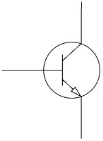
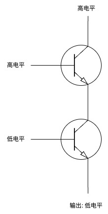
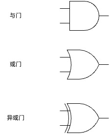
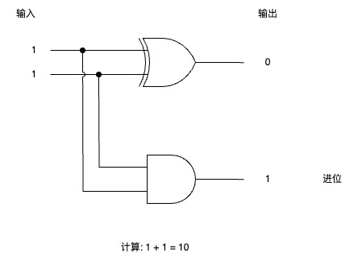
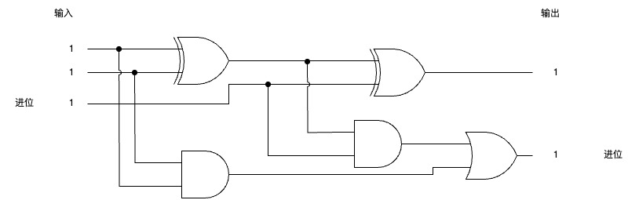
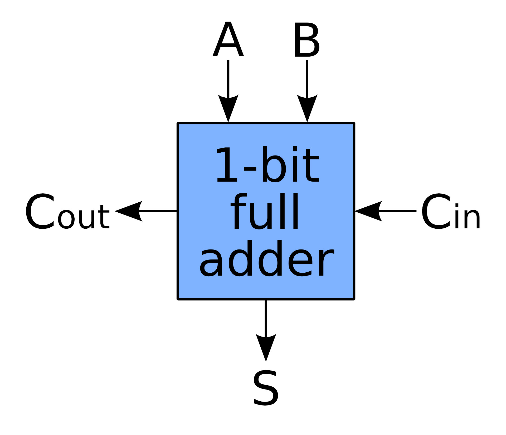
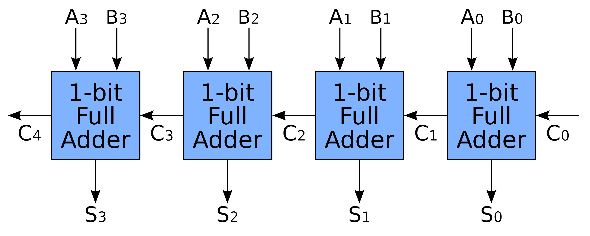

# 计算机系统概述

三极管，也称为晶体管，是一种基本的半导体器件，它具有三个端点(因此得名“三”极管)，通常用作放大器或开关。



三极管的特性:

- 左边的电极加高电平, 上下两端就会导通
- 左边的电极加低电平, 上下两端就会断开

## 逻辑运算

用三极管实现与门(高电平为 1, 低电平为 0, 只有当左边两个输入都为 1 时, 输出才是 1):



常用的门电路符号:



## 加法运算

一位二进制加法表:

```
1 + 1 = 10
0 + 1 = 01
1 + 0 = 01
0 + 0 = 00
```

与门的真值表:

| 输入 1 | 输入 2 | 输出 |
| ------ | ------ | ---- |
| 1      | 1      | 1    |
| 0      | 1      | 0    |
| 1      | 0      | 0    |
| 0      | 0      | 0    |

异或门的真值表:

| 输入 1 | 输入 2 | 输出 |
| ------ | ------ | ---- |
| 1      | 1      | 0    |
| 0      | 1      | 1    |
| 1      | 0      | 1    |
| 0      | 0      | 0    |

观察三张表可以发现:

1. 两个二进制进行异或运算, 结果就是它们相加结果的低位
2. 两个二进制进行与运算, 结果就是它们相加结果的高位(进位)

所以可以用一个与门和一个异或门, 实现一位加法器:



实际上, 对于多位二进制加法, 其中的每一位二进制除了加数和被加数外, 还需要加上低位的进位(1 或者 0):

```
  101
+ 001
________
  110
```

所以加法器需要三个输入: 加数、被加数、低位的进位。这种加法器称为一位全加器:



一位全加器的符号:



其中:

- A 和 B 是加数和被加数
- C<sub>in</sub>是低位的进位
- S 是加法运算的输出
- C<sub>out</sub>是向高位的进位

将多个一位全加器连接起来, 就能计算多位二进制了:


