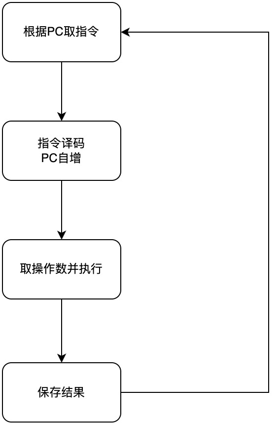

# 存储程序工作方式

"存储程序"工作方式规定，程序执行前，需要将程序所含的指令和数据送入主存储器，一旦程序被启动执行，就无须操作人员的干预，自动逐条完成指令的取出和执行任务。

如图所示，一个程序的执行就是周而复始地执行一条一条指令的过程。每条指令的执行过程包括：根据 PC 从主存储器中取指令、对指令进行译码、计算下一条指令地址、取操作数并执行、将结果送回存储器。

程序执行前，先将程序第一条指令的地址存放到 PC 中，取指令时，将 PC 的内容作为地址访问主存储器。在每条指令执行过程中，都需要计算下一条将执行指令的地址，并送至 PC。若当前指令为顺序型指令，则下一条指令地址为 PC 的内容加上当前指令的长度；若当前指令为转跳型指令，则下一条指令地址为指令中指定的目标地址。当前指令执行完后，根据 PC 的内容到主存储器中取出的是下一条将要执行的指令，因而计算机能周而复始地自动取出并执行一条一条的指令。
