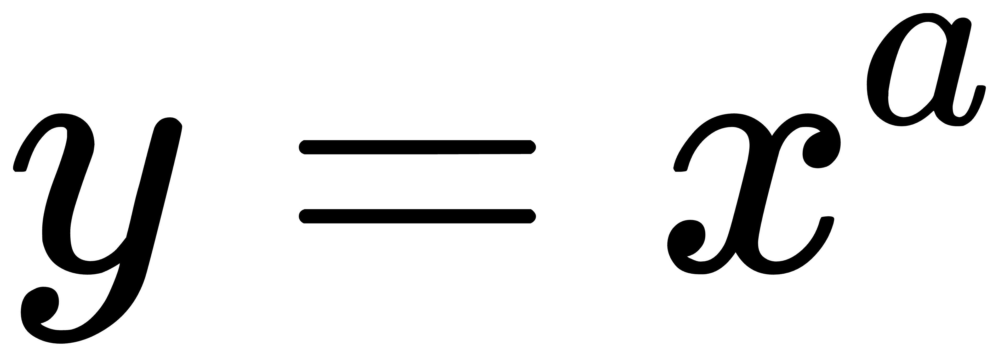
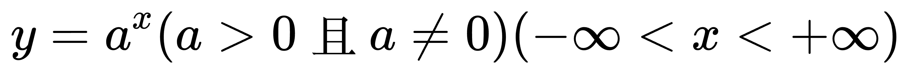
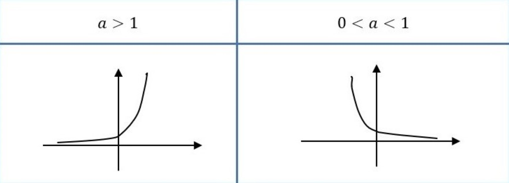
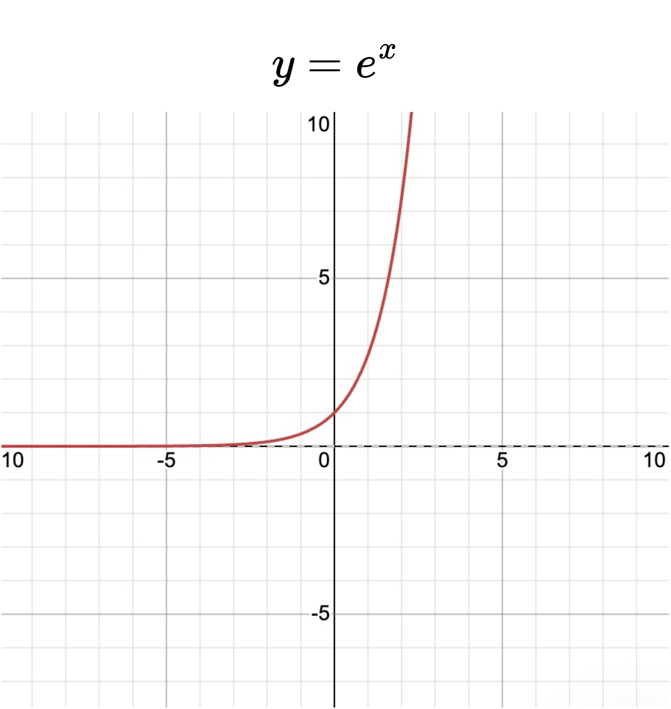
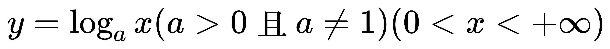
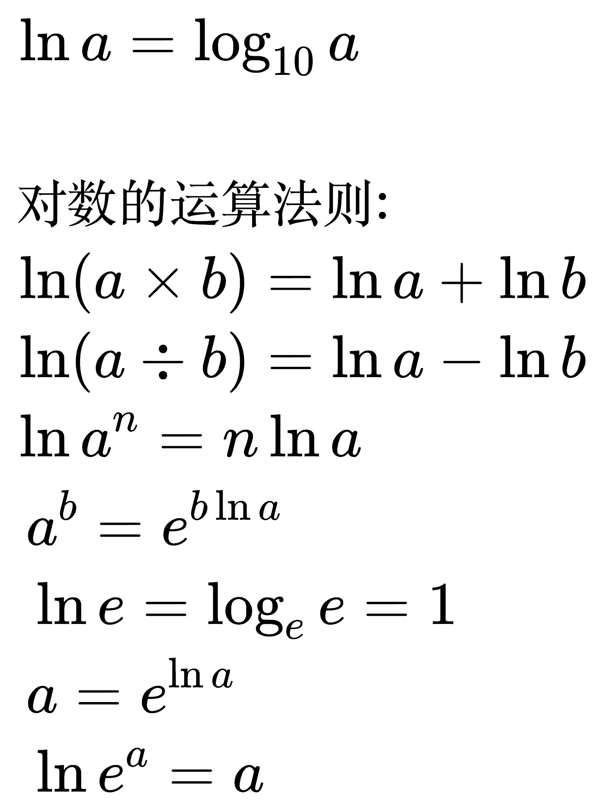
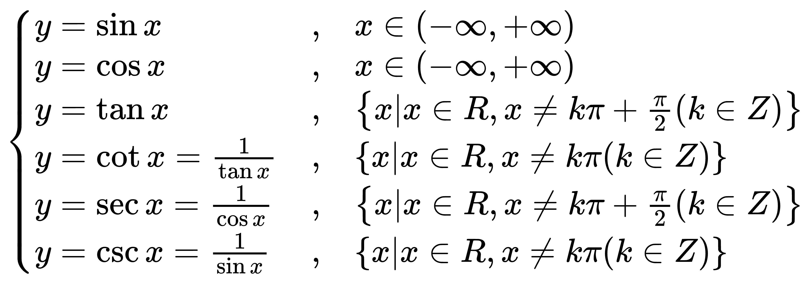
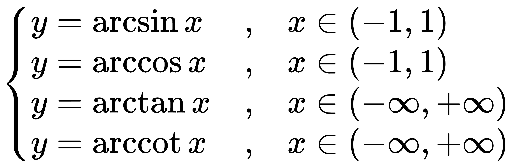

# 基本初等函数

基本初等函数分为六类: 幂函数、指数函数、对数函数、三角函数、反三角函数、常数函数。

## 幂函数(power function)

<!-- y = x^{a} -->

## 指数函数(exponential function)

<!-- y = a^{x} (a \gt 0 且 a \ne 0) (-\infty \lt x \lt +\infty) -->

## 对数函数(ogarithmic function)

<!--
\begin{align}
& y = \log_{a}{x}  (a \gt 0 且 a \ne 1) (0 \lt x \lt +\infty) \\
\\
& \log_{a}{b} 表示以a为底b的对数，即求a的多少次方等于b \\
\end{align}
-->

<!--
\begin{align}
& \, \ln a = \log_{10}{a} \\
\\
& 对数的运算法则: \\
& \, 1、\ln (a \times b) = \ln a + \ln b \\
& \, 2、\ln (a \div b) = \ln a - \ln b \\
& \, 3、\ln a^{n} = n \ln a \\
& \, 4、e^{\ln a} = a \\
& \, 5、e^{b \ln a} = a^{b} \\
& \, 6、\ln e = \log_{e}{e} = 1 \\
& \, 7、a = e^{\ln a} \\
& \, 8、\ln e^{a} = a \\
\\
& 去掉等式 \ln y = x 中的 \ln: \\
& 1、对等式两边同时取 e 的幂: e^{\ln y} = e^{x} \\
& 2、因为 e^{\ln a} = a, 所以: y = e^{x} \\
\end{align}
-->

## 三角函数(trigonometric function)

<!--
\begin{cases}
y = \sin x & , & x \in (-\infty, +\infty) \\
y = \cos x & , & x \in (-\infty, +\infty) \\
y = \tan x & , & \left \{ x | x \in R, x \ne k\pi + \frac{\pi}{2} (k \in Z) \right \} \\
y = \cot x = \frac{1}{\tan x} & , & \left \{ x | x \in R, x \ne k\pi (k \in Z) \right \} \\
y = \sec x = \frac{1}{\cos x} & , & \left \{ x | x \in R, x \ne k\pi + \frac{\pi}{2} (k \in Z) \right \} \\
y = \csc x = \frac{1}{\sin x} & , & \left \{ x | x \in R, x \ne k\pi (k \in Z) \right \} \\
\end{cases}
 -->

## 反三角函数(inverse trigonometric function)

<!--
\begin{cases}
y = \arcsin x & , & x \in (-1, 1) \\
y = \arccos x & , & x \in (-1, 1) \\
y = \arctan x & , & x \in (-\infty, +\infty) \\
y = \operatorname{arccot} x & , & x \in (-\infty, +\infty) \\
\end{cases}
-->

